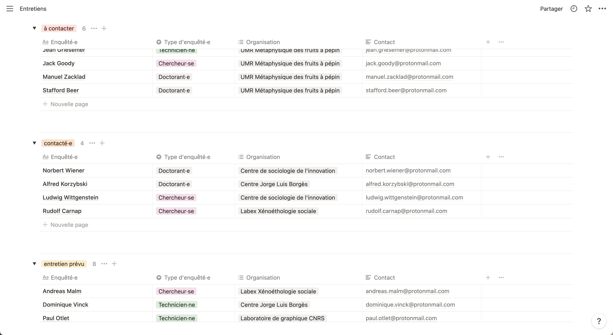

## Notion

Notion est un logiciel pour écrire, créer des arborescences de fichiers et gérer des bases de données. Il peut également être utilisé pour :

- Créer un espace de travail collaboratif
- Concevoir un petit site internet pour présenter un projet
- Tenir un carnet de recherche accessible en ligne
- Tenir une base de connaissances personnelle ou partagée.

Des données seront à disposition pour les cas d'usage suivants :

- Analyser un corpus d'images
- Gérer ses écrits de recherche
- Suivre et analyser des entretiens.

## Description de l'atelier

Une formation à destination des chercheur·ses de Sorbonne Université a eu lieu le 6 octobre 2022. Un guide, adapté de cette formation, a été réalisé, et permet d'apprendre pas à pas Notion pour l’insérer dans son processus d'enquête.

[Vous pouvez également accéder à un guide complet sur Notion](/articles/2022-03-05_guide_notion/), dans lequel vous trouverez :

- Un tutoriel pour bien débuter avec Notion
- Un exemple d'application pour l'analyse d'un corpus de tweets
- Un exemple d'application pour gérer ses écrits de recherche
- Et un exemple d'application pour la gestion et l'analyse d'entretiens d'enquête.