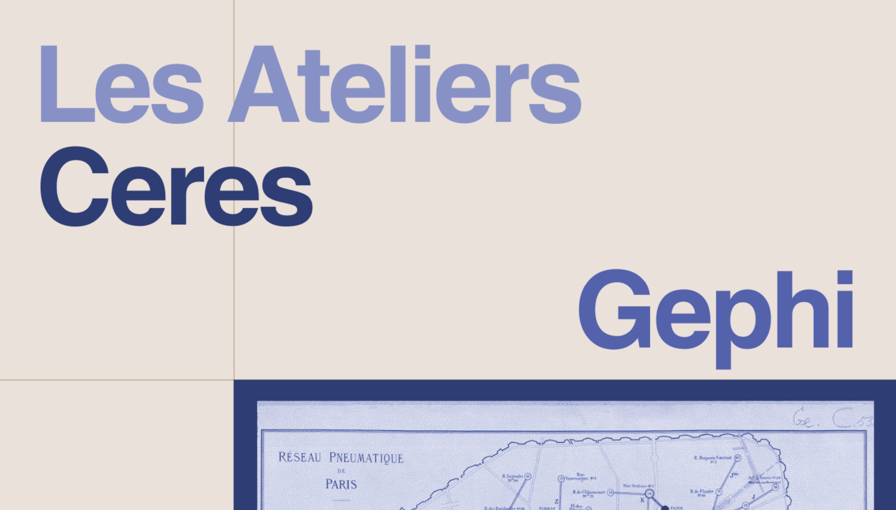

## Informations

Plusieurs ateliers autour de l'outil Gephi sont animés par le CERES. Un premier a eu lieu le 14 avril 2022, un deuxième le 2 mars 2023.

Le prochain atelier aura lieu le 28 mars 2024, en présentiel, à la Maison de la Rerche de Sorbonne Université.

## Gephi

Ce logiciel, présenté par Félix Alié (CERES), est un outil de cartographie des données sous forme de graphe. La visualisation de données en réseau peut permettre d'accompagner les chercheurs et les chercheuses en SHS dans la conduite de leurs analyses, en les aidant à mettre en lumière des relations entre différentes entités connectées entre elles. En particulier, Gephi est couramment utilisé pour étudier des relations entre acteurs sur les réseaux sociaux numériques.

Les ateliers de formation à Gephi proposés par le CERES ont pour objectif d’apprendre à constituer, à explorer et à comprendre des graphes de réseaux.

Le tutoriel proposé lors des différentes séances est accessible en cliquant sur [ce lien](https://felix-alie.notion.site/Atelier-Gephi-be091e81308741a59265318589758367).

Exemple d’application : [Bouté, E. (2021). La mise en visibilité des forces de l’ordre sur Twitter pendant le mouvement des Gilets jaunes, Questions de communication,  n°39, pages 185 à 208.](https://www.cairn.info/revue-questions-de-communication-2021-1-page-185.htm)