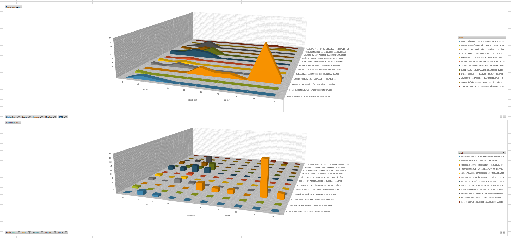

Excel est un logiciel de tableurs particulièrement connu pour être propice à la réalisation de calculs et de graphiques à partir de données numériques. Il est également tout à fait possible de l’utiliser pour manipuler des objets textuels. Cela est particulièrement pertinent lorsque des chercheur·euses disposent déjà de données formatées pour ce logiciel, ou bien enregistrées en format .csv (car elles ont été inscrites à la main par les chercheur·euses dans ce logiciel, parce qu’un logiciel de collecte a permis de construire un corpus dans le format .csv, ou encore car des jeux de données sont partagées en open data dans ce format). L’usage d’Excel pour l’analyse de textes est également pertinent lorsque le coût de migration d’un corpus déjà constitué vers des logiciels de textométrie est trop important, ou bien n’est pas nécessairement pertinent pour la question de recherche qui est en jeu.

Plusieurs ateliers ont été donnés par le CERES, les 8 décembre 2022 et 7 décembre 2023. Le premier concernait l'intérêt de l'utilisation des formules de tableurs pour la recherche en SHS. Le second atelier a été consacré à l'usage des tableaux croisés dynamiques notamment pour l'analyse de corpus de presse.

Le powerpoint de la séance, proposé sous forme de tutoriel, est mis à disposition ici. [Vous pouvez le télécharger en cliquant ici](https://ceres.sorbonne-universite.fr/fb468315ce51f952cae4806afe5d2514/Atelier_Ceres_Excel.pdf).

