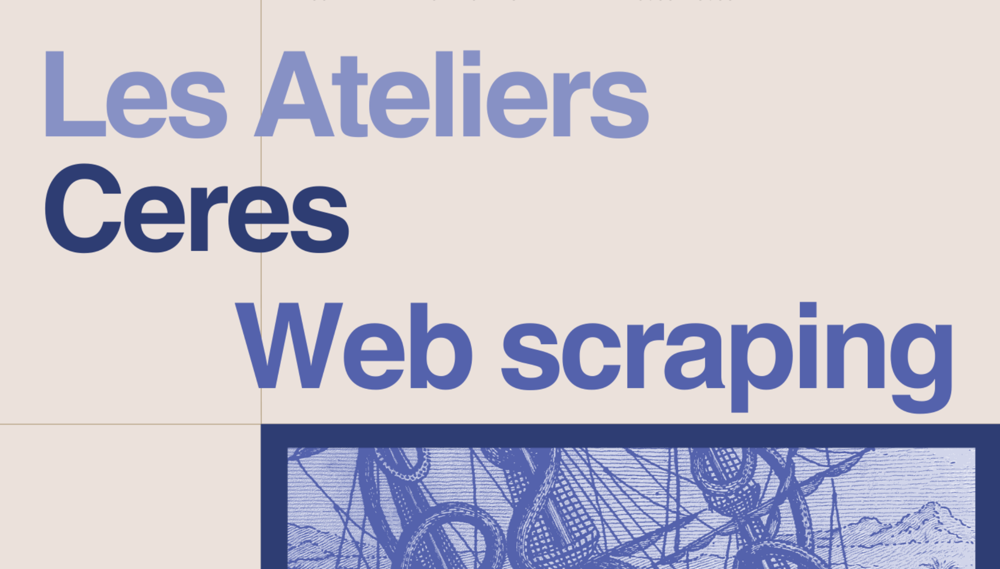

Le *web scraping* est une technique informatique utilisée pour extraire automatiquement des données à partir de sites web. Cela implique l'analyse et le téléchargement du contenu des pages web, généralement à l'aide de scripts ou de programmes spécifiques.

Le CERES a dédié plusieurs ateliers à cette pratique numérique (voir plus bas). Le prochain atelier sera dédié à l'outil [*minet*](https://github.com/medialab/minet), développé au sein du [Médialab de Sciences Po Paris](https://medialab.sciencespo.fr/), et sera animé par [Guilluame Pique](https://medialab.sciencespo.fr/equipe/guillaume-plique/), son concepteur, que nous remercions chaleureusement.

Pour s'inscrire à cet atelier, qui aura lieu le 30 mai, de 16h à 18h à la maison de la recherche de Sorbonne Université (rue Serpente), [c'est par ici !](https://framaforms.org/inscription-atelier-minet-30052024-1715337038)

## Scraping d'articles de presse et de forums

Un premier atelier a été donné par Gaël Lejeune le 20 janvier 2022. Il s'agissait d'exposer la façon dont on peut, avec cette technique :

1. Scraper des pages d'articles de presse et de forums
2. Gérer les données tabulaires
3. Préparer des données pour les utiliser notamment sur *R*.

[Le support de présentation est disponible en téléchargement](http://memes.sorbonne-universite.fr/wp-content/uploads/2022/02/Gael_Lejeune_Scraping.pdf)

## Scraper avec Octoparse

Une seconde version de l'atelier entend familiariser les participant·es avec l'outil de *web scraping* intitulé *Octoparse*. Ce logiciel dispose d’une interface graphique et de scripts pré-enregistrés, ce qui rend cet outil très intéressant pour les débutant·es en scraping. Il est également efficace pour des profils intermédiaires souhaitant récolter des données web rapidement.

Cet atelier a été donné le 11/01/2024 par Félix Alié (CERES).

