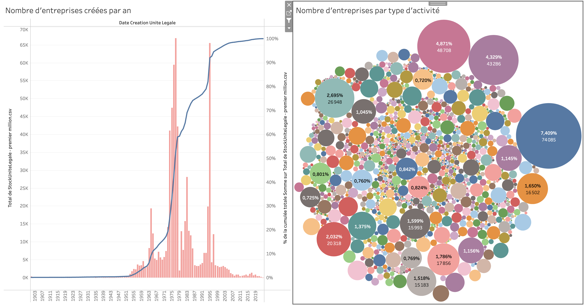

<aside>

Le prochain atelier dédié aux visualisations sous Tableau Public aura lieu le jeudi 08/02/2024 de 16h30 à 18h30 à la Maison de la Recherche de Sorbonne Université. Cet atelier, présenté par Edouard Bouté (CERES) pourra être suivi en présentiel ou en visio. Lien d'inscription : [cliquez ici](https://framaforms.org/inscription-atelier-tableau-public-08022024-1704811982)

</aside>

## Présentation de Tableau Public

Tableau public est un logiciel en ligne gratuit qui permet de créer des visualisations interactives, hautement personnalisables et accessibles en ligne. Sa particularité est que les visualisations ne sont pas construites selon des diagrammes standards, mais de manière modulaire, permettant de tester différentes manières de représenter et spatialiser les métadonnées.

Tableau public nécessite un temps d’apprentissage plus long que la plupart des autres logiciels de visualisation, mais offre plus de flexibilité, en intégrant par exemple des fonctions de traitement de données (recherche d’occurrences, concaténation, catégorisation automatique). L’interactivité permet de l’utiliser pour construire des interfaces d’exploration de corpus ou de données quantitatives, par exemple en affichant des fenêtres en survol ou en utilisant une visualisation pour en filtrer une autre.

Ce logiciel sera très utile aux chercheur·ses en sciences humaines et sociales qui souhaitent visualiser et explorer des données complexes, sans être très à l’aise avec la programmation.

## Pour aller plus loin

- [Créer un compte sur Tableau Public](https://public.tableau.com/desktop/signup_unification.html)
- [Lire le tutoriel écrit](https://ceres.sorbonne-universite.fr/tutoriels/2023-03-09_tutoriel_tableau_public/)

