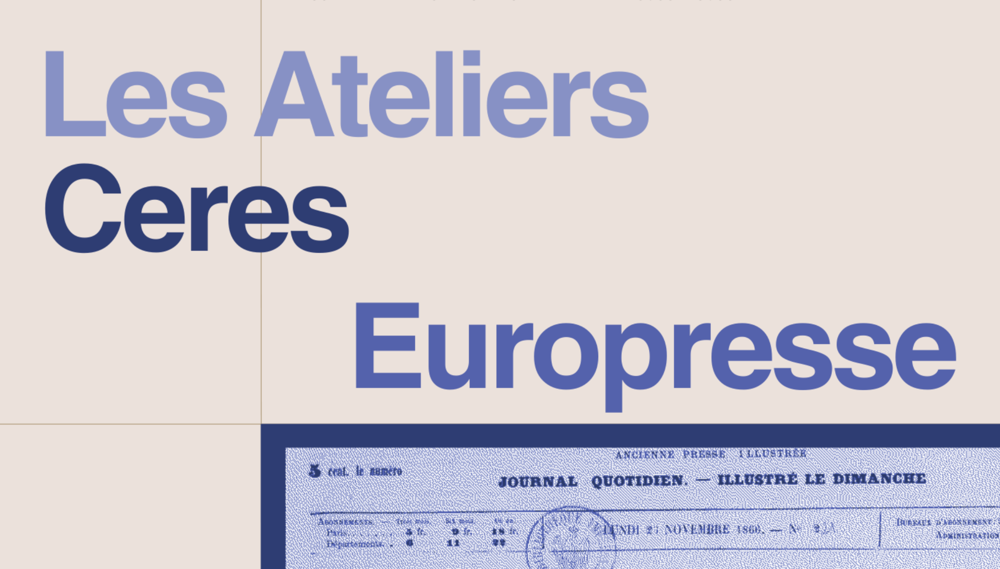

### Atelier à venir

Europresse est une base de données d'archivage d'articles de presse et de contenus informationnels issus du web. Son utilisation est courante dans la recherche en SHS lorsque l'on souhaite réaliser des analyses du traitement médiatique de discours de presse.

Informations pratiques :

- 5 décembre 2024, 16h-18h, salle D117 de la Maison de la Recherche de Sorbonne Université (28 rue Serpente, 75006 Paris)
- Atelier en **présentiel** uniquement.
- Animé par Gaël Lejeune (STIH/CERES)
- [Inscription gratuite mais obligatoire en cliquant sur ce lien.](https://framaforms.org/inscription-atelier-europresse-5122024-1726740873)

### Description des points abordés lors de l'atelier

1. La définition des corpus de manière générale.
2. La disponibilité de corpus de presse en ligne.
3. L'utilisation et les limites d'Europresse.
4. L'extraction de données structurées à l'aide de l'outil [Europarser](https://ceres.huma-num.fr/europarser) qui permet d'obtenir des fichiers HTML à partir d'Europresse.
5. L'exploitation de ces données structurées dans Excel, TXM, etc.
6. Les limites d'Europresse liées au nombre de résultats donnés par Europresse, aux questions de racinisation/lemmatisation des requêtes par le moteur Europresse, à l'extraction automatique de l'horodatage et à l'extraction automatique des rubriques.

### Archives

#### Première version de l'atelier : Automatiser et faciliter la collecte d'un corpus sur Europresse

Gaël Lejeune (STIH) et Thibault Grison (SCAI / GRIPIC), dans une intervention nommée "Automatiser et faciliter la collecte d'un corpus sur Europresse", animée par Lisa Bolz (GRIPIC), ont présenté le 30 septembre 2021 des méthodes de choix des mots-clés et des sources, ou encore des méthodes pour stocker des corpus extraits de la plateforme. Il a également été abordé la question de la visualisation de corpus par sources, et de la difficulté à produire des analyses quantitatives en raison des différentes dates d'archivages sur Europresse selon les titres de presse. Enfin, il a été abordé lors de cet atelier les manières d'automatiser la collecte de corpus pour en faciliter cette dernière.

Les supports de présentation sont disponibles au téléchargement : 

- [Support de présentation de Gaël Lejeune](CERES-europresse-1.pdf)
- [Support de présentation de Thibault Grison](Atelier_CERES_Europresse.pdf)

#### Seconde version de l'atelier : utiliser l'outil Europarser pour la collecte et la structuration de corpus d'articles de presse

[Support de présentation de l'atelier](CERES-europresse-2.pdf) 

Dans cet atelier qui a eu lieu le 26 novembre 2023, Gaël Lejeune a présenté différentes problématiques liées à :

1. La définition des corpus de manière générale.
2. La disponibilité de corpus de presse en ligne.
3. L'utilisation et les limites d'Europresse.
4. L'extraction de données structurées à l'aide de l'outil [Europarser](https://ceres.huma-num.fr/europarser) qui permet d'obtenir des fichiers HTML à partir d'Europresse.
5. L'exploitation de ces données structurées dans Excel, TXM, etc.

Pour la partie *extraction*, vous pouvez vous référer au [tutoriel](https://ceres.sorbonne-universite.fr/b9bad163-a7f9-400f-b0d1-6a727a8c69e8/) que nous avons mis à disposition en ligne.

Quelques problèmes ont été identifiés et seront abordés dans de futurs ateliers :

- Le nombre de résultats donné par Europresse.
- Le questionnement sur la racinisation/lemmatisation des requêtes par le moteur Europresse.
- L'extraction automatique de l'horodatage.
- L'extraction automatique des rubriques.
