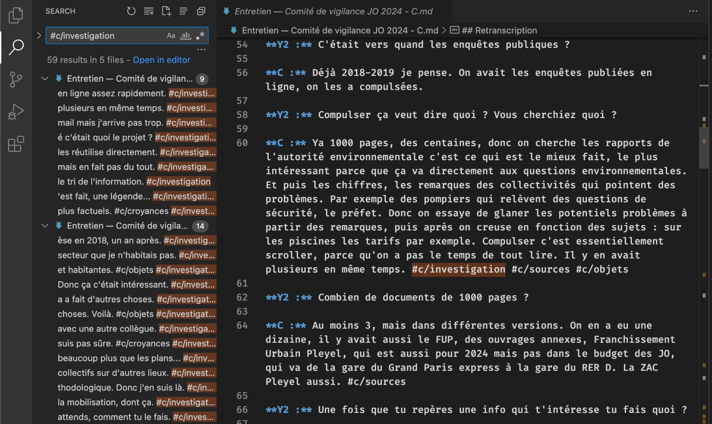

## Informations

- Mardi 25 avril 2023 – 10h-12h
- Maison de la Recherche, 28 rue Serpente, 75006, Paris – Salle sur inscription
- [Lien d'inscription](https://framaforms.org/seminaire-doctoral-ceres-du-25042023-1681377105)

## Revenir sur l'itinéraire méthodologique emprunté : Construire un répertoire de gestes de mise en rapport avec le monde

Au cours de sa présentation, Aurélie Sansen reviendra sur les différents gestes successivement déployés pour réaliser ces ensembles photographiques. Elle interrogera donc d’une part les manières par lesquelles une forme photographique se transforme — ou s’in-forme — progressivement en un objet de recherche grâce à l’adoption d’habiletés et dextérités personnelles propres au chercheur, et reviendra, d’autre part, sur les questionnements soulevés par le maniement de tels protocoles méthodologiques.

Pour cela, Aurélie Sansen envisagera successivement trois moments qui se caractérisent chacun par le déploiement de gestes spécifiques. En considérant un premier moment pré-sémiotique, elle devinera que le geste de prélèvement se détermine nécessairement au regard des liens qu’elle entretient avec son « milieu ». Elle examinera ensuite les gestes d’organisation et de restitution qui, par la recomposition des contours des photographies prélevées depuis l’application Instagram, l’ont engagée dans une sur-sémiotique. Enfin, elle verra que l’alliance entre les gestes d’analyse et de qualification de la forme collectée, désormais devenue objet de recherche, s’avère être la marque d’une poly-sémiotique.

Les propos seront illustrés par deux enquêtes menées depuis le compte personnel Instagram de la doctorante et initiées conséquemment aux mesures de distanciation et de restriction des déplacements annoncées respectivement les 16 mars et 28 octobre 2020.

## Écritures calculées et catégorisation inductive : L’intérêt de la structuration informatique des écrits intermédiaires de recherche en sciences sociales

Les développements méthodologiques en humanités numériques se concentrent souvent sur la collecte, l’enrichissement, le traitement et la visualisation de données qui n’ont pas été écrites par des chercheur·ses. Pourtant, les textes produits dans le cadre d’une recherche peuvent également être manipulés par des programmes. Victor Ecrement tentera de montrer que prendre en compte cette dimension au cours de l’écriture peut ouvrir de nouvelles perspectives méthodologiques.

Ainsi, il présentera quelques exemples de manipulations informatiques sur des écrits intermédiaires de recherche en sciences sociales : notes d’observations, commentaires d’observations, documents méthodologiques, retranscriptions d’entretiens, fiches thématiques, commentaires de documents, analyses intermédiaires, fiches de lecture, etc. Ces exemples sont issus de deux enquêtes qualitatives avec une dimension ethnographique, pour suggérer comment des chercheur·ses dont les observables ne sont ni des textes ni des bases de données pourraient bénéficier de méthodes d’humanités numériques.

En montrant des manipulations sur les logiciels Visual Studio Code et Notion, Victor Ecrement développera 2 ensembles d’usages :

 - Les écritures calculées : comment utiliser des nomenclatures, des structures de documents et des balises pour extraire des données de ses propres écrits.
 - La catégorisation inductive : comment s’appuyer sur la calculabilité des écrits pour stabiliser des concepts au cours d’un processus d’analyse, voire d’une enquête.

## Les intervenant·e·s

- **Aurélie Sansen** est doctorante en quatrième année au sein du laboratoire GRIPIC (Sorbonne Université) sous la direction de Valérie Jeanne Perrier (GRIPIC) et Joëlle Le Marec (Museum National d’Histoire Naturelle). Elle étudie les manières dont nous habitons, affectivement et cognitivement, à l’entre-deux de milieux « réel » et « virtuel ». Elle s’appuie, dans le cadre de ce travail, sur des ensembles photographiques constitués au gré de ses déambulations personnelles quotidiennes menées tout à la fois « en ligne » et « hors ligne ».
- [**Victor Ecrement**](../../membres/ecrement_victor/) a été formé en design à l’ENSCI et en recherche en sciences de l’information et de la communication au CELSA. Il est ingénieur d’études au CERES, où il conçoit des logiciels pour la recherche et des méthodes de visualisation de données. Il étudie l’interaction entre pratiques de production de connaissance et systèmes documentaires, en particulier au sein de recherches participatives et d’enquêtes militantes. Il commencera en octobre 2023 une thèse sur les représentations du social et de l’économie qui sous-tendent les scénarios de transition énergétique et leurs modèles numériques, co-encadrée par Virginie Julliard et Diego Landivar.

## Le séminaire

Pour la deuxième année consécutive, les doctorant.es de l’unité de service CERES de la Sorbonne organisent un séminaire à destination des doctorant.es et masterant.es sur différentes approches des méthodes numériques.

Ce séminaire a pour objectif de faire se rencontrer des doctorants.es de différentes disciplines en sciences humaines et sociales. Nous aurons le plaisir d’écouter plusieurs positionnements face à une pluralité de méthodes, parfois difficiles à prendre en main.

Le séminaire se déroulera en deux parties. D’abord nous écouterons pendant une heure environ deux doctorant.e.s qui présenteront leurs approches, questionnements, découvertes ou difficultés. Ensuite, nous proposerons un temps d’échange qui concerne tout·e·s les doctorant·e·s et masterant·e·s soucieux et soucieuses de partager leurs questions de recherche mobilisant les méthodes numériques (cela commence même avec Excel !) ou leurs interrogations sur la pertinence à mobiliser ces dites méthodes.

## Calendrier des prochaines séances

- 30/05/2023 : Marie-Lise Buisson (doctorante Gripic) et Ri Pierce-Grove (doctorante Columbia)
- 13/062023 : Ivanne Hermant (doctorante Sorbonne)
