<aside>

Si vous souhaitez lire le guide au format pdf ou l'imprimer, vous pouvez [accéder au fichier mis en page](guide-notion.pdf).

</aside>

## Introduction

### Qu’est-ce que Notion ?

[Notion](https://www.notion.so) est un logiciel de gestion de projet, qui est surtout employé par les développeur·ses et des entrepreneur·ses. C’est un outil très puissant et polyvalent, qui évolue vite grâce à une dynamique d’écoute de la communauté. Néanmoins, il ne s’adresse à l’origine pas à des chercheur·ses et certaines fonctions essentielles à la recherche sont parfois négligées par l’équipe de développement : [beaucoup d’usager·es demandent l’introduction de notes de bas de page depuis 2019](https://twitter.com/notionhq/status/1098033975681929217).

Il y a beaucoup de manières de décrire Notion, voici quelques-unes que je retiendrais :

- C’est un logiciel pour concevoir ses propres outils informatiques, sans coder.
- Il permet de créer et de rendre accessible son contenu en ligne, comme sur un site internet.
- Il aide à représenter des bases de données très complexes de différentes manières, en fonction de ses besoins.

Étant designer de formation, j’ai commencé à utiliser Notion pour centraliser mes listes de tâches, suivre l’avancement de mes projets, les documenter ou encore partager facilement des documents de travail. Mais c’est en commençant la recherche en sciences sociales que j’ai vraiment exploré en profondeur ses possibilités, notamment en terme de bases de données. Je suis souvent assez surpris que peu de chercheur·ses l’utilisent, alors j’ai pensé que ça vaudrait le coup d’écrire ce tutoriel.

Cela étant dit, Notion n’est pas un logiciel libre : son code n’est pas en libre accès et il est maintenu par une entreprise à but lucratif. Cela implique qu’il est possible qu’à l’avenir l’entreprise décide d’appliquer plus de restrictions sur les comptes gratuits, et que vous et moi ne soyions plus en mesure de l’utiliser. Ça signifie aussi que tout le savoir élaboré lors de sa conception ne sera probablement jamais partagé et réutilisé par d’autres, ce que je trouve très dommage. Je vous encourage donc à réfléchir avant de l’utiliser pour n’importe quel projet, et à garder un oeil sur les alternatives libres comme [FocalBoard](https://www.focalboard.com/) (qui à mon sens n’est pas encore tout à fait viable).

### Avant de commencer

Trois choses à prendre en compte avant de commencer la lecture de cet article :

- Vous n’apprendrez pas ici toutes les fonctions de Notion. L’idée est qu’à la fin, vous ayiez suffisamment d’exercice pour comprendre son potentiel et créer vos propres outils. Si vous voulez approfondir, l’équipe de développement entretient [un wiki extrêmement clair et bien construit](https://www.notion.so/fr-fr/help) qui peut répondre à toutes vos questions. Il y a également [une communauté d’entraide très créative et active sur Reddit](https://www.notion.so/fr-fr/help).
- Ce tutoriel a été tiré d’une formation conçue d’abord pour l’équipe du [Centre d’expérimentation en méthodes numériques pour les recherches en Sciences Humaines et Sociales - CERES](http://memes.sorbonne-universite.fr/), puis rendue accessible aux chercheur·ses de Sorbonne Universités. Je vous conseille donc fortement de le lire en entier et dans l’ordre, parce que chaque partie s’appuie sur les connaissances acquises dans la précédente.
- Le guide contient beaucoup de petits exercices pratiques et il est fortement conseillé de les réaliser en parallèle. N’hésitez pas à passer du temps pour explorer tout ce qui est suggéré et plus : comme tout outil, Notion s’apprend en manipulant.

La première partie est une introduction aux fonctions essentielles de Notion, elle est peu focalisée sur les sciences sociales. Les 3 parties suivantes se présentent sous la forme de cas d’usage possibles pour les chercheur·ses en sciences sociales : analyse d’un corpus de tweets, gestion d’écrits de recherche et gestion et analyse d’entretiens.

## Licence et droits d’usage

Ce guide est disponible sous licence creative commons [CC BY-NC-SA 4.0](https://creativecommons.org/licenses/by-nc-sa/4.0/legalcode). Cela signifie que vous êtes autorisé·e à :

- Partager : copier, distribuer et communiquer le matériel par tous moyens et sous tous formats.
- Adapter : remixer, transformer et créer à partir du matériel pour toute utilisation.

Selon les conditions suivantes :

- Attribution : Vous devez créditer l'œuvre "Utiliser Notion dans la recherche en sciences sociales", son auteur Victor Ecrement, intégrer un [lien vers la licence](https://creativecommons.org/licenses/by-nc-sa/4.0/legalcode) et le site web de l'oeuvre originale et indiquer si des modifications ont été effectuées à l'Oeuvre. Vous devez indiquer ces informations par tous les moyens raisonnables, sans toutefois suggérer que l'Offrant vous soutient ou soutient la façon dont vous avez utilisé son Oeuvre.
- Pas d’Utilisation Commerciale : Vous n'êtes pas autorisé à faire un usage commercial de cette Oeuvre, tout ou partie du matériel la composant.
- Partage dans les Mêmes Conditions : Dans le cas où vous effectuez un remix, que vous transformez, ou créez à partir du matériel composant l'Oeuvre originale, vous devez diffuser l'Oeuvre modifiée dans les mêmes conditions, c'est-à-dire avec [la même licence](https://creativecommons.org/licenses/by-nc-sa/4.0/legalcode) avec laquelle l'Oeuvre originale a été diffusée.
- Pas de restrictions complémentaires : Vous n'êtes pas autorisé·e à appliquer des conditions légales ou des mesures techniques qui restreindraient légalement autrui à utiliser l'Oeuvre dans les conditions décrites par la licence.

## 1. Débuter avec Notion

### Créer un compte

Un des gros avantages de Notion est qu’il propose un “education plan”, ce qui fait que la version complète est gratuite si vous avez un adresse mail affiliée à une université ou une école. Lorsque vous créez un compte, je vous conseille donc de suivre les instructions sur la page [Notion for education](https://www.notion.so/product/notion-for-education).

<aside>

✎ Créez un compte Notion avec une adresse affiliée à une université.

</aside>

Juste après la création de votre compte, Notion va vous proposer des modèles de page ou de bases de données pour des usages particuliers : tableau de comptabilité, liste de notes de cours, compte-rendus de réunions, etc. D’expérience, je déconseillerais fortement de les utiliser : ça ne permet pas de comprendre comment ils ont été construits. Mieux vaut partir de zéro et assimiler les principes de base du logiciel.

<aside>

✎ Pour le moment, cliquez sur le bouton `+ Ajouter une page` sur la barre de gauche pour créer votre première page.

</aside>

### Fonctions de base : traitement de texte

Vous voilà avec une page, qui est pour le moment très vide. Vous pouvez écrire un titre, et ignorer les modèles que l’on vous propose.

<aside>

✎ Une fois le titre écrit, appuyez simplement sur `Enter` pour commencer avec votre page vide.

</aside>

#### Les blocs et leur comportement

Le concept de base de Notion, c’est les blocs. À chaque fois que vous revenez à la ligne, vous créez un nouveau bloc. Lorsque vous les survolez, vous voyez deux icônes :

- Le `+` sert à rajouter un bloc en-dessous et à choisir sa nature. Pour le moment, on peut négliger cette fonction.
- Le `⠿` sert à ouvrir un menu, qui donne accès à des options à propos de ce bloc.

La première particularité des blocs, c’est qu’on peut les réarranger manuellement, en cliquant-glissant sur le symbole `⠿`. L’avantage, c’est que le paragraphe est une unité de sens assez fiable : on apprend assez tôt que l’on doit sauter une ligne lorsqu’on passe à une autre “idée”. En facilitant leur réagencement, Notion permet de recomposer un raisonnement très facilement.

Même si la majorité des interfaces que l’on créera avec Notion seront séquentielles, il est possible de disposer les blocs en largeur, c’est à dire de faire des colonnes. Pour cela, il suffit de cliquer-glisser un bloc à droite ou à gauche d’un autre bloc.

<aside>

✎ Écrivez quelques phrases en revenant plusieurs fois à la ligne. Essayez de réarranger manuellement les blocs et de faire des colonnes.

</aside>

#### Mode texte, mode bloc

Vous aurez sûrement remarqué que quand vous cliquez sur l’icône `⠿`, le bloc se surligne en bleu, et qu’il faut cliquer dedans pour pouvoir y écrire à nouveau. C’est parce qu’un document Notion a deux “modes” :

- un mode traitement de texte, où vous pouvez déplacer votre curseur avec les flèches de votre clavier : `←` `↑` `↓` `→`
- un mode bloc, où les flèches directionnelles vous feront sauter de bloc en bloc, ce que vous verrez facilement avec le surlignage bleu

Vous pouvez également accéder au mode bloc en appuyant sur la touche `esc`, et passer au mode texte en appuyant sur `enter` quand un bloc est sélectionné.

Le mode bloc peut servir à sélectionner plusieurs blocs à la fois, pour réarranger manuellement de grosses portions de votre document. Si vous sélectionnez deux blocs en restant appuyé sur `shift`, tous les blocs entre eux seront sélectionnés aussi, et vous pourrez tous les bouger.

<aside>

✎ Sélectionnez plusieurs blocs et réarrangez-les.

</aside>

#### Raccourcis clavier pour le traitement de texte

[Notion comprend une profusion de raccourcis clavier](https://www.notion.so/help/keyboard-shortcuts), on va en passer en revue quelques-uns qui sont particulièrement utiles pour faire du traitement de texte rapidement. Évidemment, les traditionnels `cmd/ctrl` + `C` et `cmd/ctrl` + `V` fonctionnent.

| Raccourci | Fonction | Description |
| --- | --- | --- |
| cmd/ctrl + D | Dupliquer le bloc | Quel que soit le mode où vous êtes, vous pouvez dupliquer le bloc où est votre curseur. C’est particulièrement utile si vous souhaitez conserver la mise en forme (soulignage, formule récurrente) mais changer le contenu du bloc. |
| cmd/ctrl + X | Couper le bloc | Quel que soit le mode où vous êtes, vous pouvez couper le bloc où est votre curseur. Vous pouvez ensuite le coller autre part avec cmd/ctrl + V  : il s’insèrera toujours sous le bloc où se trouve votre curseur. |
| cmd/ctrl + A | Sélectionner tout le contenu du bloc | Dans la plupart des logiciels de traitement de texte, ce raccourci permet de sélectionner tout le texte du document. Mais ici, chaque bloc est comme un petit contenant, et cmd/ctrl + A  sélectionnera uniquement le contenu du bloc. Il est donc facile de copier le contenu d’un bloc pour le coller dans un autre, plus finement qu’avec la méthode cmd/ctrl + X. |

Bien que très basiques, utiliser régulièrement ces raccourcis permet de beaucoup accéler le traitement de texte, en particulier quand ils sont combinés avec d’autres raccourcis que l’on verra plus tard.

<aside>

✎ Réarrangez vos blocs à l’aide de ces raccourcis.

</aside>

#### Le `/` et les types de blocs

Vous l’aurez sûrement déjà remarqué, à chaque nouveau bloc vide, Notion vous propose de “taper ‘/’ pour les commandes”. Taper un `/` n’importe où dans Notion vous donne accès à tous les types de blocs et à certaines options de personnalisation de bloc. Ça fait beaucoup, mais la plupart de ces blocs sont des objets graphiques que vous connaissez déjà. Voici les blocs de base pour la traitement de texte :

| Nom du bloc | Description |
| --- | --- |
| Texte | Les blocs de texte que vous utilisez depuis le début. |
| Titre 1 | Un grand titre. |
| Titre 2 | Un moyen titre. |
| Titre 3 | Un petit titre. |
| Listes à puces | Une liste avec un •. |
| Listes de tâches | Une liste de cases à cocher |
| Listes numérotées | Une liste avec des numéros. |
| Menu dépliant | Un bloc dépliant qui peut contenir d’autres blocs. |
| Blocs médias | Notion propose un ensemble de blocs pour incorporer des médias : images, vidéos, son, pdfs, etc. Mais un simple cliquer-glisser d’un fichier dans Notion fera tout à fait l’affaire. |
| Blocs médias incorporés | Notion propose également d’incorporer des médias d’autres plateformes : vidéos youtubes, page web, logiciels, etc. Dans ces cas-là, un simple lien collé dans un bloc texte suffira à faire apparaître des options d’affichage. |
| Table des matières | Une table des matières interactive, générée et mise à jour automatiquement à partir des titres présents dans la page. Très pratique pour les documents qui atteignent une certaine longueur. |

<aside>

✎ Essayez ces différents blocs. Vous pouvez aussi copier-coller une partie d’un de vos documents et le formater avec ces blocs.

</aside>

Le `/` est très polyvalent, voici d’autres manières de l’utiliser :

- Après l’avoir inséré, écrivez le nom de la commande que vous voulez. Le menu va changer au fur et à mesure que vous tapez. Une fois que vous aurez en vue le bloc qui vous intéresse, vous pourrez le sélectionner en cliquant, ou avec les flèches puis `enter`. Par exemple, si je cherche les listes de tâches, je peux taper `/liste`.
- Il est possible de changer la nature d’un bloc avec la fonction `transformer en`, accessible depuis le menu `⠿`. Mais le `/` peut aussi aider, il suffit de taper `/transformer` ou `/turn` puis le nom de la commande que vous voulez. Par exemple `/turn list` transformera le bloc en liste à puce.

Je pense que vous commencez à le voir : Notion permet de mettre en forme très précisément un document en utilisant uniquement le clavier, ce qui est beaucoup plus rapide qu’avec la souris ou le trackpad.

<aside>

✎ Créez des blocs de différentes nature en les appelant par leur nom, changez la nature de blocs avec `/turn`.

</aside>

### Toujours plus vite : quelques conseils pour optimiser le traitement de texte

<aside>

⚑ Cette partie s’adresse aux personnes souhaitant faire de Notion leur outil de traitement de texte principal et présente des options plus spécialisées et qui demandent un peu de temps à mémoriser.

Si vous ne comptez pas avoir cet usage de Notion ou si vous êtes simplement impatient·e d’arriver à la partie sur les bases de données, vous pouvez la sauter. Vous en savez déjà bien assez sur les fonctions de base comme ça.

</aside>

#### Le balisage

Le `/` n’a pas l’exclusivité de la création de blocs rapide, le balisage peut aussi être très utile ! Notion est en partie basé sur un *langage de balisage* appelé [Markdown](https://daringfireball.net/projects/markdown/), qui est une sorte de HTML (qu’on utilise pour écrire des pages web) très simplifié.

Les balises sont des caractères, comme `#`, qui la plupart du temps seront reconnus par Notion lorsque vous les placez en début de ligne et que vous ajoutez un espace. En voici quelques-unes qui pourront vous être utiles dans votre apprentissage du traitement de texte dans Notion :

- `# texte` : titre 1
- `## texte` : titre 2
- `#### texte` : titre 3
- `“ texte` : citation
- `1. texte` : liste numérotée
- `- texte` : liste à puces
- `> texte` : menu dépliant
- `* texte *` : italique
- `** texte **` : gras

<aside>

✎ Essayez d’écrire quelques lignes en mettant en forme votre texte à l’aide des balises.

</aside>

#### Plus de raccourcis clavier

Comme mentionné précédemment, c’est possible de changer la nature du bloc dans lequel se trouve votre curseur. Les raccourcis suivants permettent de le faire très rapidement :

- `cmd/ctrl` + `option/alt` + `1` : changer le bloc en titre 1
- `cmd/ctrl` + `option/alt` + `2` : changer le bloc en titre 2
- `cmd/ctrl` + `option/alt` + `3` : changer le bloc en titre 3
- `cmd/ctrl` + `option/alt` + `4` : changer le bloc en liste de tâches
- `cmd/ctrl` + `option/alt` + `5` : changer le bloc en liste à puces
- `cmd/ctrl` + `option/alt` + `6` : changer le bloc en liste numérotée
- `cmd/ctrl` + `option/alt` + `7` : changer le bloc en menu dépliant
- `cmd/ctrl` + `option/alt` + `8` : changer le bloc en bloc code
- `cmd/ctrl` + `option/alt` + `9` : changer le bloc en page
- `cmd/ctrl` + `option/alt` + `0` : changer le bloc en texte

En utilisant ces raccourcis avec le mode bloc, on peut facilement remettre en forme son texte, par exemple en sélectionnant un ensemble de lignes pour en faire une liste de tâches, ou en écrivant un plan sous forme de liste puis en le transformant en titres.

Comme la plupart des langages de balisage, Markdown peut avoir des blocs contenus dans des blocs. C’est également le cas sur Notion, on peut par exemple inclure une liste dans une citation, ou créer des arborescences de listes grâce à ça. Comme dans HTML ou d’autres langages de balisage, quand un bloc est contenu dans un autre, tous les paramètres du bloc parent s’appliquent au bloc enfant : couleur, fond, etc.

Pour inclure un bloc dans celui qui est immédiatement au-dessus, il suffit d’appuyer sur `tab`. Pour sortir un bloc d’un autre, il faut appuyer sur `shift` + `tab`.

<aside>

✎ Formatez votre texte avec ces raccourcis clavier. Créez des listes hiérarchisées avec `tab` et `shift` + `tab`.

</aside>

### Fonctions avancées : liens et bases de données

Notion est un outil de traitement de texte très pratique, mais l’essentiel de ses possibilités résident dans son interactivité : il permet de construire des outils interactifs en plus de documents statiques.

#### Créer des sites internet comme on écrit un texte

Avant de passer aux bases de données, il est important de noter qu’il existe des blocs un peu plus complexes, qui vont pour certains servir de base à la construction d’outils de gestion de la connaissance. Les plus utiles sont les pages et les liens :

| Nom du bloc | Raccourcis | Description |
| --- | --- | --- |
| Page | /page, +[nom de la page], @[nom de la page], cmd/ctrl + option/alt + 9 | Créer une sous-page dans la page actuelle. Notion privilégie une structure arborescente où chaque nouvelle page est contenue dans une autre. |
| Lien vers une page | /link, /lien, @[nom de la page], +[nom de la page], [[ [nom de la page], coller l’URL de la page | Permet de créer des liens entre vos pages sans nécessairement qu’elles soient contenues l’une dans l’autre. Très pratique pour circuler rapidement entre vos écrits de recherche. |

L’avantage de la création de sous-pages dans une page est qu’elle permet de réunir dans une seule interface 2 types de données qui sont souvent séparées : le texte et les fichiers. Cela signifie que vous pouvez avoir sous les yeux à la fois une liste de tâches, un ensemble de documents pertinents accessibles en un clic et des éléments de contexte pour ces documents. Les pages sont comme des contenants : vous pouvez cliquer-glisser des blocs dedans.

Avec ces options en main, vous avez quasiment tout ce qu’il faut pour créer de petits sites internet par vous-même ! On commence à rentrer dans la partie où l’on crée des outils, et à partir de là, les usages se diversifient beaucoup. Vous pourriez vous en servir comme un wiki personnel, pour conserver des fiches de lecture, pour organiser vos notes, pour présenter votre CV, etc.

<aside>

✎ Créez un mini-site internet avec des sous-pages et des liens entre les pages.

Pour qu’il ressemble plus à un site internet, vous pouvez utiliser l’option `Pleine largeur` située dans le menu `•••` en haut à droite de la page. N’hésitez pas à diviser votre page en colonnes.

Si vous ne savez pas quoi mettre comme texte, vous pouvez utiliser un [générateur de lorem ipsum](https://loremipsum.io/).

</aside>

Vous aurez peut-être remarqué le bouton `Partager` en haut à droite, c’est une des fonctions les plus utiles de Notion. Il y a deux manières de partager ses documents :

- `Partager sur le web` : cette option permet d’attribuer des droits de regard, de commentaire ou de modification généraux : n’importe qui avec le lien et un compte notion peut y avoir accès.
- `Inviter` permet d’attribuer des droits de regard, de commentaire et de modification à des adresses mail en particulier.

En combinant les deux, vous pourriez par exemple collaborer avec des ami·es sur un article tout en le rendant visible par tous·tes, mais pas éditable. Vous pouvez aussi créer de petites plateformes pour publiciser vos productions, comme dans un carnet [hypotheses.org](http://hypotheses.org), ou encore mettre en place un gros espace contributif pour travailler avec toute une équipe ! Chaque page a ses paramètres de partage uniques, mais elle adopte par défaut les paramètres de la page dans laquelle elle est contenue.

<aside>

✎ Rendez votre site internet accessible en ligne et essayez de l’envoyer à un·e ami·e.

</aside>

#### Types de bases de données

<aside>

⚑ Pour le reste de cette première partie, on va explorer les possibilités des bases de données. Je ne fournirai pas encore d’application spécifique (on verra ça dans les parties 2, 3 et 4), mais je me suis efforcé de donner des exemples d’usage pour chaque fonction.

Je vous recommande donc d’avoir un objectif, en sélectionnant des données que vous aimeriez bien manipuler. Sans ça, cette partie pourra être un peu abstraite pour vous.

</aside>

Quand on est chercheur·se, on passe une bonne partie de son temps à côtoyer des “données” : on les collecte, on les stocke, on les analyse, on les visualise, etc. Ça tombe bien, une des fonctions principales de Notion, c’est la base de données.

Elle se présente souvent sous la forme d’un tableau mais peut être visualisée de plein de manières différentes. C’est le point essentiel à retenir : quand on crée une table, un calendrier, une galerie ou une liste, *on utilise toujours une base de données*. Ça implique qu’on peut voir une table comme une galerie, une chronologie comme une liste ou un tableau kanban comme un calendrier. Dans ce cas-là, on appellera “vues” ces différentes manières de visualiser une base de données.

Voici les 6 types de bases de données :

| Base de données | Raccourci | Description |
| --- | --- | --- |
| Table | /vue, /data | Une tableur dont les colonnes peuvent être de différentes natures : textes, nombres, tags, dates, adresses mail, etc. |
| Galerie | /vue g, /gal | Un ensemble de vignettes qui peuvent afficher des images en couverture. |
| Liste | /vue l | Un liste de pages. |
| Calendrier | /vue c, /cale | Un calendrier où l’on peut ajouter des évènements. |
| Chronologie | /ch | Une frise chronologique que l’on peut faire défiler horizontalement. |
| Tableau kanban | /kan | Une série de colonnes qui contiennent des cartes, que l’on peut bouger d’une colonne à l’autre. |

Chacun de ces types de base de donnée comprend :

- Un objet de base : dans le calendrier ce seront des évènements, dans le tableau kanban ce seront plutôt des tâches.
- Des "propriétés” qui vont s’appliquer aux objets. Par exemple, on pourra noter le lieu correspondant à un évènement dans un calendrier, ou la personne à qui la tâche sera attribuée dans un tableau kanban.

Certaines propriétés seront obligatoires pour utiliser un type de base de données : on ne peut pas avoir de calendrier sans propriété qui indique la date.

#### Créer une base de données

Pour la recherche en sciences sociales, ce seront surtout les tables et les listes que l’on va utiliser, mais les galeries et les calendriers peuvent se révéler utiles. La table est la vue la plus complète et la plus facilement manipulable, c’est souvent par là que je commence, quoi que je veuille faire.

<aside>

✎ Créez une vue table dans votre page en tapant `/vue` ou `/data`.

Une fois insérée, Notion vous demandera de “sélectionner une source de données”. Comme vous n’avez pas encore de base de données, il vous faudra en créer une nouvelle. Cliquez sur `+ Nouvelle base de données`.

Donnez un titre à votre base de données en remplissant le champ en haut à gauche.

</aside>

Vous disposez maintenant d’une table avec 3 lignes et 2 colonnes. Les colonnes sont :

- `Nom` : le nom des objets de votre base de données.
- `Étiquettes` : une colonne qui permet de créer des tags, des catégories que vous pouvez appliquer à vos objets.

<aside>

✎ Donnez un `Nom` à chacune des 3 lignes en fonction de vos objets de recherche. Vous pourriez par exemple lister des personnes que vous devez interviewer, des lieux où faire des observations, des textes à lire, des verbatims issus d’entretiens, des organisations sur lesquelles vous avez fait de la recherche documentaire, etc.

</aside>

<aside>

✎ Attribuez-leur des catégories dans la colonne `Étiquettes`. Encore une fois, elles dépendront de ce que vous cherchez.

</aside>

#### Multiplier les vues

Comme je l’expliquais plus haut, ce tableau est une *représentation* d’une base de données, mais on peut la représenter d’autres manières.

<aside>

✎ Cliquez sur `+ Ajouter une vue` au-dessus du titre de votre base de données pour créer une nouvelle vue.

Choisissez un autre type de vue, nommez cette vue et cliquez sur `Créer`.

</aside>

Notez bien qu’il est possible de créer une deuxième `Table`. C’est parce qu’une vue ne se réduit pas à un type de base de donnée, elle inclut aussi :

- quelles propriétés vous souhaitez afficher
- comment vos propriétés sont organisées
- comment vous souhaitez filtrer, trier et grouper vos objets

En fonction de la vue que vous avez choisi, il est possible que vos `Étiquettes` ne soient plus affichées. Pour les retrouver, il faut :

1. cliquer sur le menu `•••` en haut à droite de votre base de données
2. sélectionner `Propriétés`
3. ajuster les propriétés que vous souhaitez voir dans la section `Afficher dans [nom du type de vue]`

<aside>

✎ Créez plusieurs vues, explorez un peu.

Ajustez les propriétés que vous souhaitez voir.

</aside>

#### Écrire dans un objet

Vous l’avez peut-être déjà remarqué : lorsque vous survolez une case de la colonne `Nom` dans votre vue `Table`, Notion pour propose d’`OUVRIR` l'objet. Si vous cliquez dessus, vous vous retrouvez avec une nouvelle page vierge.

C’est un aspect très intéressant des bases de données dans Notion, que peu d’autres logiciels proposent : en plus des propriétés, les objets peuvent avoir du contenu. Cela peut par exemple vous permettre de :

- prendre vos notes dans une liste de lectures
- préparer des communications pour des séminaires
- écrire vos compte-rendus illustrés par des photos dans un tableau d’observations
- créer une base de données d’articles pour un petit site internet

Évidemment, chaque page peut elle-même contenir une ou des bases de données. 

<aside>

✎ Écrivez quelques lignes à l’intérieur de vos objets.

</aside>

#### Types de propriétés

Maintenant que vous avez exploré les possibilités des vues et des pages, revenons à la vue `Table` pour découvrir les propriétés.

On sait déjà qu’on peut nommer les objets et leur attribuer des catégories, mais il existe beaucoup de types de propriétés différentes. Vous pouvez en créer une nouvelle en appuyant sur le `+` à droite de votre colonne `Étiquettes`.

Vous pouvez sélectionner le `Type` de propriété dans le menu qui s’ouvre. Voici celles qui nous seront les plus utiles :

| Propriété | Description |
| --- | --- |
| Texte | Un champ de texte classique avec quelques options de mise en forme. Utile pour noter des remarques qualitatives à propos des objets. Je l’utilise par exemple pour noter des informations sur mes enquêté·es dans une liste d’entretiens, ou pour faire un premier passage qualitatif dans une analyse de corpus. |
| Nombre | Un nombre, que l’on peut formater pour qu’il s’affiche en %, en €, etc. On pourrait l’utiliser par exemple pour noter le nombre de pages d’un document, de manière à pouvoir les trier sur cette base. |
| Sélection multiple | Un champ qui permet de créer des catégories. C’est le type du champ Étiquettes que l’on a vu plus haut. Il est extrêmement utile pour la recherche, parce qu’une fois qu’on a attribué des catégories à un objet, c’est très facile de réorganiser sa base de données en fonction. Ce type de propriété a des usages très diversifiés : noter des catégories de codage d’entretien, attribuer des thèmes à des documents, décrire les éléments présents sur une image, noter les organisations auxquelles appartient une personne, etc. |
| Sélection | Un champ qui permet de créer des catégories mais n’en accepte qu’une seule à la fois. Il peut être utile dans certains cas : attribuer un niveau d’analyse à un objet (à analyser, en cours, analysé par exemple), attribuer un statut à un document (documentation, corpus, bibliographie par exemple). |
| Date | Permet de choisir une date et de la formater selon différents standards. Elle est utile pour s’organiser lorsqu’on accumule les séances d’observation, les entretiens, les focus groups, etc. Elle peut aussi servir rétrospectivement, pour retracer son parcours de recherche. |
| Case à cocher | Une simple case à cocher pour signifier un état positif ou négatif. Peut remplacer une colonne sélection s’il n’y a que deux options. |
| Fichiers et médias | Permet d’associer n’importe quel type de fichier à un objet. Ça pourrait être des vidéos d’observations, des enregistrements d’entretiens, des photographies, des articles à lire ou des présentations pour des colloques. Depuis peu, Notion peut afficher des images directement dans les tableaux plutôt que sous la forme de fichiers à ouvrir, ce qui peut être très utile pour une analyse de corpus. |
| URL | Un lien. Je l’utilise peu, parce que les champs de texte permettent de faire la même chose mais sont plus flexibles : on peut en mettre plusieurs, les mélanger avec du texte, etc. |

| Propriétés avancées | Description |
| --- | --- |
| Date de création | Attribue automatiquement une date à la création de l’objet. Particulièrement utile pour naviguer dans de grosses masses de notes personnelles. |
| Relation | Permet de créer des liens entre des objets de différentes bases de données, ou de la même base de données. Cette propriété est un peu complexe à comprendre et utiliser, mais elle peut avoir beaucoup d’usages. Par exemple elle pourrait aider pour l’étude des réseaux sociaux (liens entre des personnes) ou pour établir des liens entre des concepts dans une liste de définitions. |

Comme je l’expliquais précédemment, il est possible de masquer une propriété inutile sur une vue, tout en la conservant pour les autres vues. Vous pouvez le faire simplement en cliquant sur le titre d’une colonne dans une vue table, puis `Masquer dans la vue`, ou à l’aide du menu `•••` en haut à droite, puis `Propriétés`. Je vous conseille de toujours masquer plutôt que supprimer une propriété, sauf si vous savez que vous ne vous en servirez pas.

<aside>

✎ Étoffez votre tableau avec les propriétés qui vous semblent utiles. N’hésitez pas à les réarranger et à les renommer.

Revenez ensuite sur les autres vues que vous avez créées, puis ajustez les propriétés que vous souhaitez voir dedans.

</aside>

#### Filtrer, trier, grouper

Quand on a suffisamment qualifié les objets de sa base de données Notion (avec des catégories, des dates, des lieux, des organisations, des liens, etc.), il devient très facile de les réorganiser en fonction de ses objectifs.

Il y a 3 manières de réorganiser les bases de données, qui peuvent être combinées. Vous pouvez y accéder en cliquant sur le menu `•••` en haut à droite :

- `Filtrer` : n’afficher que les objets qui répondent à certains critères, comme par exemple les entretiens :
    - réalisés après le `1er janvier 2022`
    - avec les personnes catégorisées comme `assistant·es sociaux·les`
- `Trier` : ordonner les objets selon une ou plusieurs propriétés, comme par exemple le niveau d’analyse d’un objet :
    - `à analyser` en haut
    - `en cours` en milieu
    - `analysé` en bas
    
    L’ordre adopté pour le tri avec une colonne `Sélection` est le même que l’ordre des catégories dans le champ. Vous pouvez les réarranger en cliquant sur une case de la colonne et en cliquant-glissant le symbole `⠿` à gauche des catégories.
    
- `Grouper` : comme un tri, mais permet de créer des groupes clairement distincts et dépliables. Très utile quand on doit visualiser de grandes quantités de données facilement. C’est la fonction que j’utilise le plus. Vous pouvez réarranger l’ordre des groupes dans ce menu à l’aide de la poignée `⠿`.

<aside>

✎ Filtrez, triez et groupez vos vues comme vous l’entendez. N’oubliez pas que ces options sont spécifiques à chaque vue, et qu’ainsi vous pouvez créer 12 vues liste qui auront des usages différents.

Vous pouvez passer un certain temps à explorer ces possibilités, on est ici au coeur de la manipulation de données avec Notion.

Vous pourriez par exemple répertorier l’ensemble des objets sur le site de Castorama, les grouper par couleur et les trier par prix. Puis créer une autre vue où ne seraient visibles que l’image de l’objet et une colonne `Sélection`, afin de décrire les éléments présents sur l’image sans vous encombrer des autres champs. Les possibilités sont infinies quand on aime la classification !

</aside>

## 2. Application : analyse d’un corpus de tweets

<aside>

⚑ Les 3 parties suivantes se présentent sous la forme de tutoriels plutôt que d’un guide explicatif. Il n’y aura plus d’encarts activité, libre à vous de le suivre comme bon vous semble ou simplement de les lire.

Dans cette partie, on va apprendre à :

- importer en tant que base de données un fichier `.csv` décrivant des tweets préalablement scrapés
- formater les propriétés pour qu’elles soient utilisables
- mettre en place un processus d’analyse
- visualiser un corpus d’images avec une vue galerie

Si vous n’êtes pas intéressé·e par ces fonctions, vous pouvez passer directement aux parties sur la gestion d’écrits de recherche et la gestion et analyse d’entretiens. Néanmoins, comme ce guide est écrit de manière séquentielle, il se peut que je passe un peu vite sur certaines manipulations dans les parties 3 et 4.

</aside>

### Importer et mettre en forme un tableau

Notion permet d’importer des données depuis d’autres formats ou logiciels. Vous pouvez donc extraire des données en ligne ou les saisir sur d’autres logiciels, puis les importer en `.csv` sur Notion pour pouvoir les manipuler. C’est ce qu’on va commencer par faire.

Dans le menu de gauche, cliquer sur `Importer`, puis `CSV`. Choisir son fichier `.csv` dans l’ordinateur.

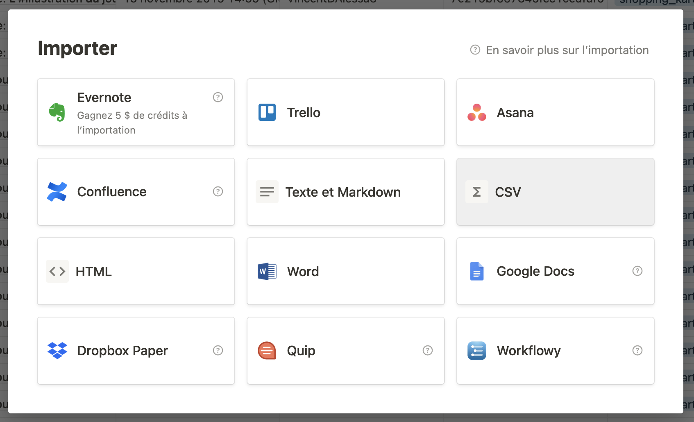

Voici les champs qui sont contenus dans mon fichier `.csv` :

- texte : le texte du tweet
- date de création
- utilisateur·rice : le nom de l’utilisateur·rice
- sha1 : un code qui permet de reconnaître qu’une image est issue d’un retweet
- average hash : un code qui est similaire si les images sont similaires
- catégorie : une première passe de catégorisation des images qui a été réalisée par d’autres chercheur·ses
- image : un lien vers une image hébergée sur un serveur de Sorbonne Université

Notion ne reconnaîtra pas toujours de lui-même les types de propriété qui nous intéressent, il affichera donc la plupart des colonnes comme des champs de texte. Mais si les données sont correctement écrites, ce sera possible de changer de type de propriété sans les perdre.

Changer le champ “image” en propriété de type `Fichiers et médias`. Dans mon cas, ce sont des URL qui sont contenus dans ce champ, Notion va donc aller chercher l’image à cet URL et l’afficher s’il peut y accéder. Ça ne fonctionnera que si n’importe qui peut la visualiser, donc une image contenue sur un stockage en ligne comme Google Drive ne fonctionnera probablement pas.

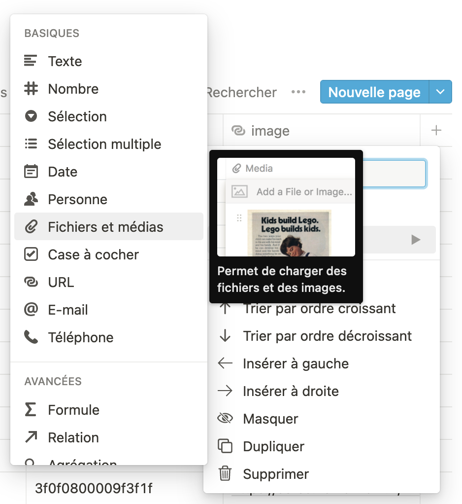

Les autres chercheur·ses ont classé mes images en 6 catégories distinctes, je peux donc changer le champ “catégorie” en propriété de type `Sélection`. Le texte se transformera automatiquement en tags.

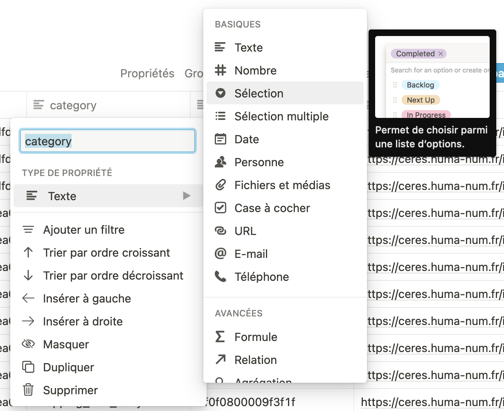

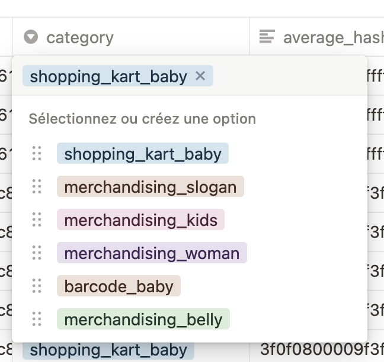

Notion a de lui-même reconnu que le champ “date” était une `Date` et les autres champs peuvent rester du texte, ça ne changera rien à mon analyse

### Mettre en place des catégories d’analyse

Maintenant que nos propriétés s’affichent correctement, on peut commencer à imaginer comment on va analyser ces centaines de tweets et d’images. Je vais commencer par ajouter des champs pour pouvoir qualifier les images :

- Une propriété `Texte` que j’appelle “Description” : une description écrite de l’image.
- Une propriété `Sélection multiple` que j’appelle “Signes iconiques” : les éléments discernables dans l’image : une voiture, un sandwich, Philippe Poutou, etc.
- Une propriété `Sélection multiple` que j’appelle “Thèmes” : les grands thèmes auxquels renvoient l’image : la mobilité, la faim, l’anticapitalisme, etc.
- Une propriété `Sélection` que j'appelle “Matérialité”, elle me permet d’indiquer de quel genre d’image il s’agit : caricature, dessin à la main, photographie, montage, collage, dessin vectoriel, texte, etc.

Avec ça, je pourrais par exemple commencer par décrire l’image dans la colonne “Description”, puis laisser d’autres chercheur·ses partir de cette matière pour remplir les catégories.

Sur Twitter, il est très courant de retweeter, reprendre ou modifier une image. Je vais donc avoir beaucoup de doublons et je risque de perdre beaucoup de temps. Pour aller plus vite dans l’analyse, ça peut être intéressant de grouper, en fonction de mes besoins :

- soit par “sha1” : un code qui permet de reconnaître qu’une image est issue d’un retweet
- soit par “average hash” : un code qui est le même si les images sont les mêmes, même si elles n’ont pas le même sha1.

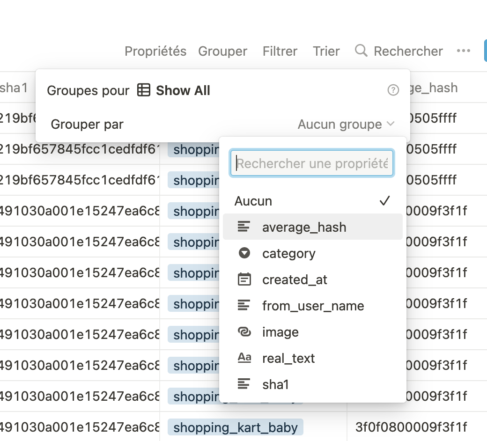

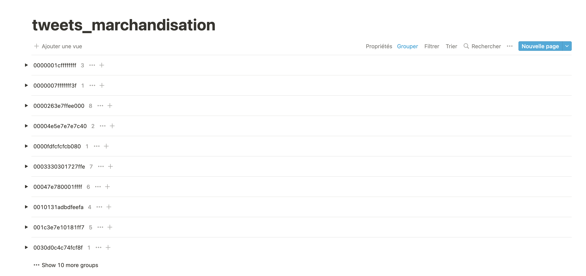

Une fois ce groupage fait, j’aurai donc un ensemble de groupes de tweets, dont je pourrais analyser l’image une fois et copier-coller sur les autres.

### Assurer le suivi de l’analyse

Plusieurs options peuvent aider à garder le fil de l’analyse :

- Si je travaille seul·e, créer un champ `Case à cocher` qui s’appellera “Analysé”. Je la cocherai une fois que j’aurai terminé de catégoriser un tweet, et je peux ajouter un filtre qui cache les éléments une fois analysés.
    
    
    
    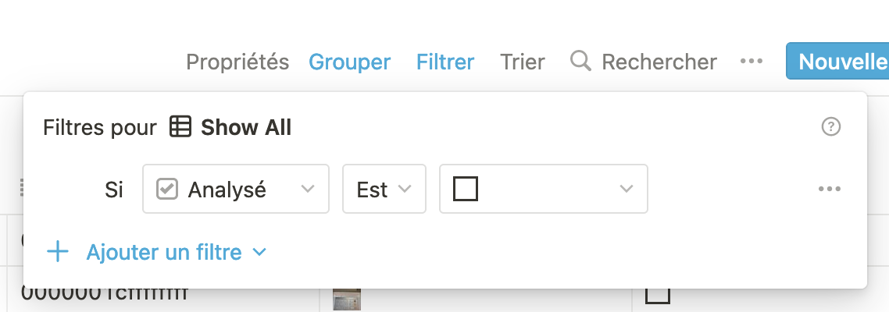
    
- Si je travaille à plusieurs, on pourra utiliser une propriété `Sélection` dans laquelle seront précisés les niveaux d’analyse. Par exemple : `à décrire`, `décrit`, `catégorisé`.
- On peut également dupliquer la vue actuelle pour inverser le filtre, et n’afficher que les éléments taggés comme `catégorisé`. De cette manière, on peut revenir en arrière dans l’analyse, ou exploiter ces données sans avoir à reconcevoir la vue originale.

En général, je conseillerais de toujours dupliquer la vue actuelle plutôt que d’en créer une nouvelle, ça permet de ne pas perdre tous les paramètre de tri, de groupe, de taille et d’ordre de colonne, etc.

### Visualiser des corpus d’images

La vue `Tableau` peut servir à analyser des images, mais elle ne donne pas vraiment d’aperçu d’ensemble, les images sont trop petites. Alors une vue `Galerie` peut aider !

Créer une vue galerie. Aller dans `•••` puis `Propriétés`, et sélectionner la propriété qui contient les images dans `Aperçu des cartes`. De cette manière, les images vont s’afficher en couverture des vignettes.

Toutes les propriétés ne sont pas encore visibles, on peut les ajuster dans `•••` puis `Propriétés`. Pour moi, c’est intéressant d’afficher le texte du tweet, la date de création et les différentes catégories d’analyse que j’ai définies tout à l’heure.

Si je souhaite modifier les tags attribués à un tweet, je peux simplement cliquer sur l’image et ajuster le contenu des propriétés dans l’objet.

Cette vue galerie peut ensuite être enrichie avec divers groupes ou tris, il y a beaucoup d’usages à imaginer. Je peux par exemple grouper par utilisateur·rice et trier par date de création, de manière à voir les trajectoires individuelles.

### Exporter ses données

Il est toujours possible d’exporter une base de données Notion pour l’exploiter sur d’autres logiciels. Notion peut donc facilement s’insérer dans une chaîne de traitement de données plus large, tant qu’on n’utilise pas de propriétés trop spécifiques à ce logiciel, qui vont difficilement se transcrire en `.csv`. C’est par exemple le cas du type de propriété `Relation`, qui s’exportera sous la forme d’URL vers des pages Notion.

Pour l’exporter, cliquez sur le bouton `⟷` en haut à droite de votre base de données pour l’afficher en tant que page. Vous pouvez également accéder à cette option en cliquant sur le menu  `⠿` tout à gauche, puis en sélectionnant `Ouvrir en tant que page`. Vous pourrez alors cliquer sur le menu `•••` en haut à droite, sélectionner `Exporter` et choisir l’option `Markdown et CSV`.

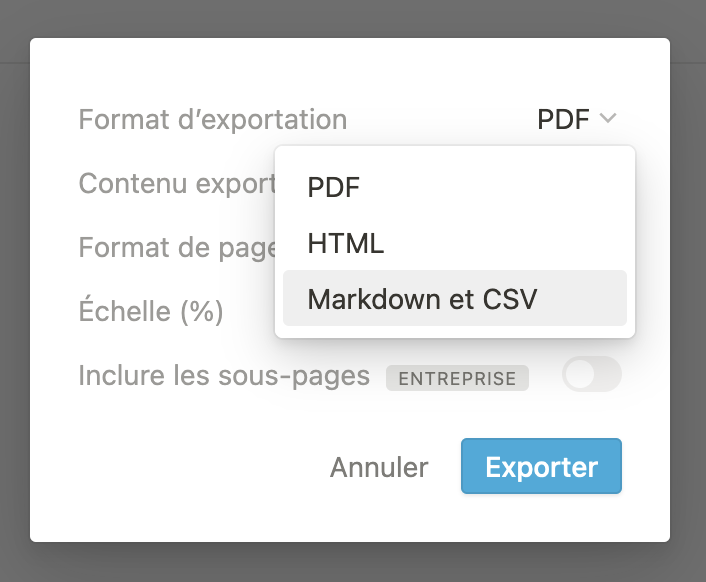

## 3. Application : gestion d’écrits de recherche

<aside>

⚑ Lorsqu’on écrit en recherche, on a souvent beaucoup de notes de différentes natures qui sont éparpillées, mal classées ou justement trop ordonnées et que l’on arrive pas à mettre en lien. Notion peut aider à trouver facilement ce qu’on cherche, à assembler des éléments disparates et à garder un oeil sur ses écrits en cours. On va donc apprendre entre autres à :

- inclure ses écrits dans une vue liste
- grouper et trier ses écrits par domaine, par statut et par date
- créer des sous-écosystèmes documentaires pour fluidifier la navigation entre les notes
</aside>

### Tableau d’écrits

Créer un tableau simple et copiez-collez le contenu de toutes vos notes dedans. Comme chaque ligne d’un tableau est une page, vous pouvez stocker n’importe quel objet Notion dans une base de données. Les pages ne sont donc pas nécessairement des notes, mais peuvent comprendre des diagrammes, des tableaux, des calendriers, etc.

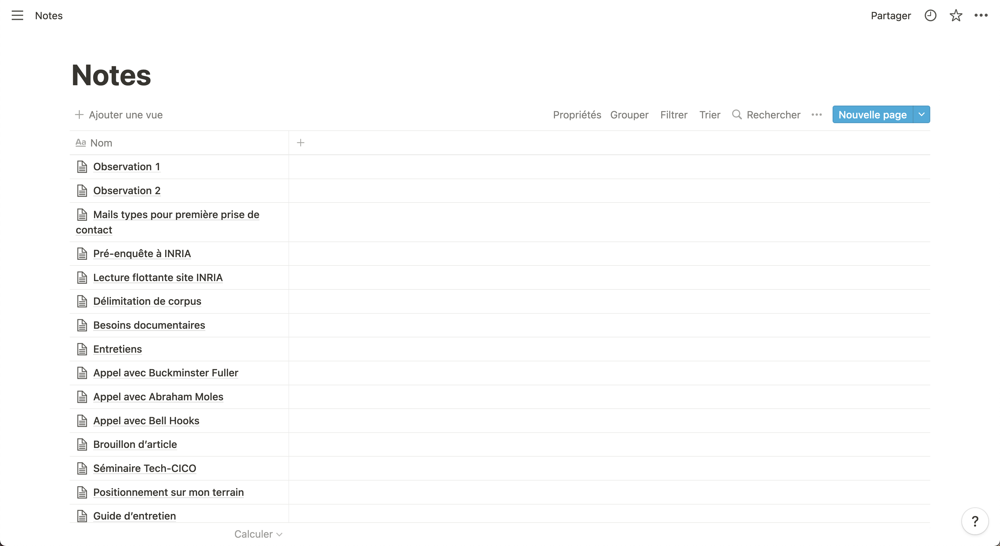

Créer une colonne `Sélection` intitulée “Domaine”, dans laquelle on va qualifier l’activité de recherche où s’inscrit la note. Par exemple : `Données`, `Cadrage`, `Suivi`, `Productions`, `Communications`.

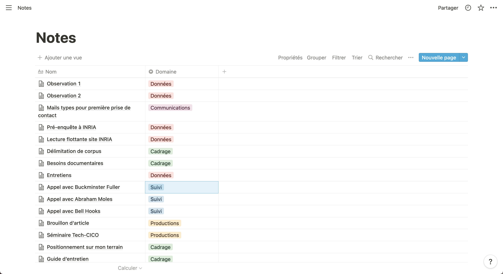

Ajouter une colonne `Date de création`, qui va servir à classer nos notes par date de création.

### Liste d’écrits organisée

Créer une vue sous forme de `Liste`, pour pouvoir accéder aux notes plus rapidement et avoir une interface moins chargée. Afficher la date de création en allant dans les `Propriétés` si elle n’est pas là d’emblée.

Grouper les notes par domaine. Pour grouper les éléments d’une base de données, mieux vaut utiliser une colonne `Sélection` plutôt que `Sélection multiple`, autrement ils apparaîtront dans autant de groupes qu’ils ont de tags.

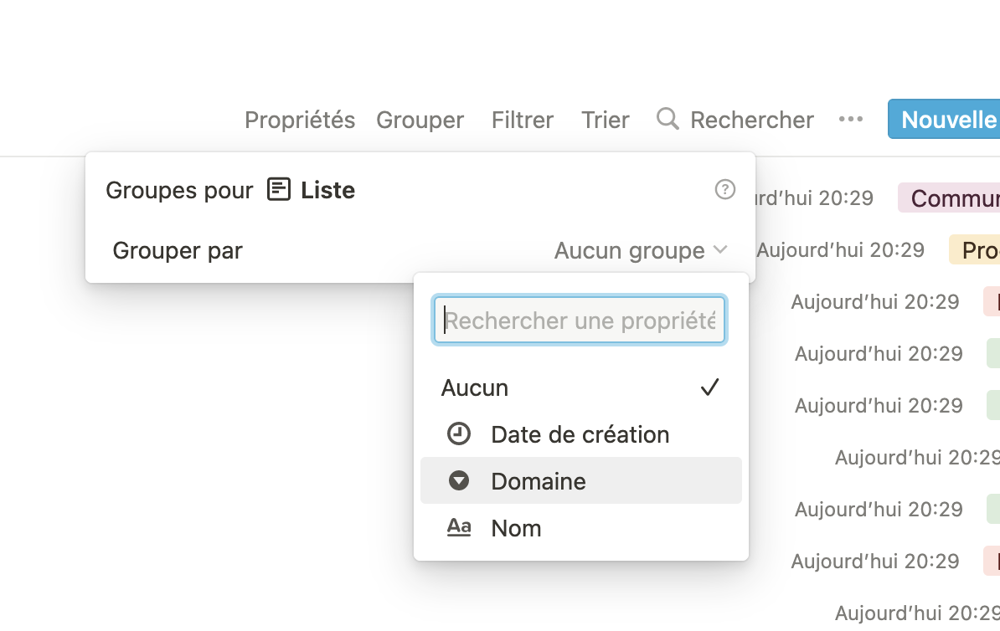

Réorganiser les groupes selon vos besoins dans l’option `Grouper` et masquer la propriété “Domaine”, qui ne nous sert plus puisque nos notes sont déjà groupées par domaine.

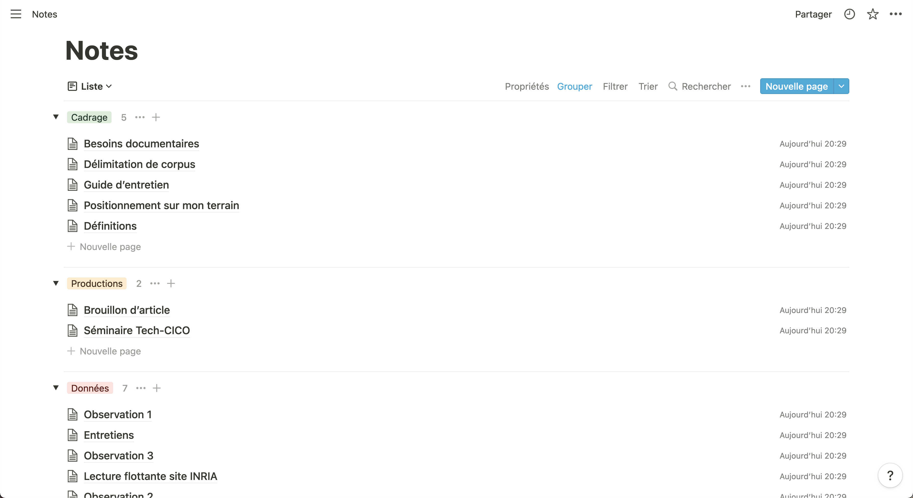

Vous pouvez `Trier` les notes par date de création pour pouvoir identifier rapidement les écrits qui sont le plus d’actualité. Mais même si elles sont triées par date, on peut parfois avoir simplement trop de notes et ne plus s’y retrouver. Pour résoudre ce problème, j’utilise une propriété supplémentaire pour qualifier l’état d’avancement d’un document, que j’appelle souvent “Statut”.

Dans la vue tableau, ajouter une colonne `Sélection` intitulée “Statut”. Elle peut comprendre par exemple :

- `En cours` : les documents de travail en cours.
- `En attente` : les documents qui demandent encore du travail mais qui ont été mis de côté pour le moment.
- `Référence` : les documents achevés qui doivent nourrir le travail actuel, par exemple un guide d’entretien ou une note de cadrage épistémologique.
- `Achevé` : les documents achevés qui ne sont pas à réutiliser dans l’immédiat, par exemple un compte-rendu de pré-enquête.
- `Dépassé` : les documents qui ont servi mais dont certains éléments sont trop datés pour être utilisés directement, par exemple une vieille note d’intentions.

Pour plus de clarté, vous pouvez attribuer des couleurs à vos tags. Pour moi, ce qui est dépassé sera plutôt rouge, ce qui est en cours sera jaune et les documents de référence verts. Pour anticiper le tri des documents, je vous conseille également d’ordonner les tags dans la propriété, en vous demandant ce que vous aimeriez voir en premier et en dernier. Personnellement, je mets toujours les documents en cours tout en haut et les documents dépassés tout en bas.

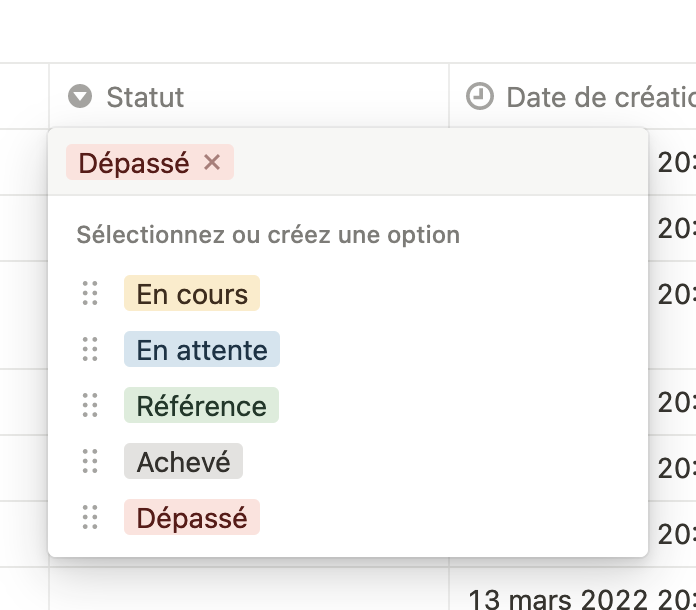

Une fois que les statuts sont attribués pour chaque document, retourner dans la vue `Liste` et y afficher la propriété “Statut”. Vous pouvez désormais `Trier` vos notes par statut, puis par date de création.

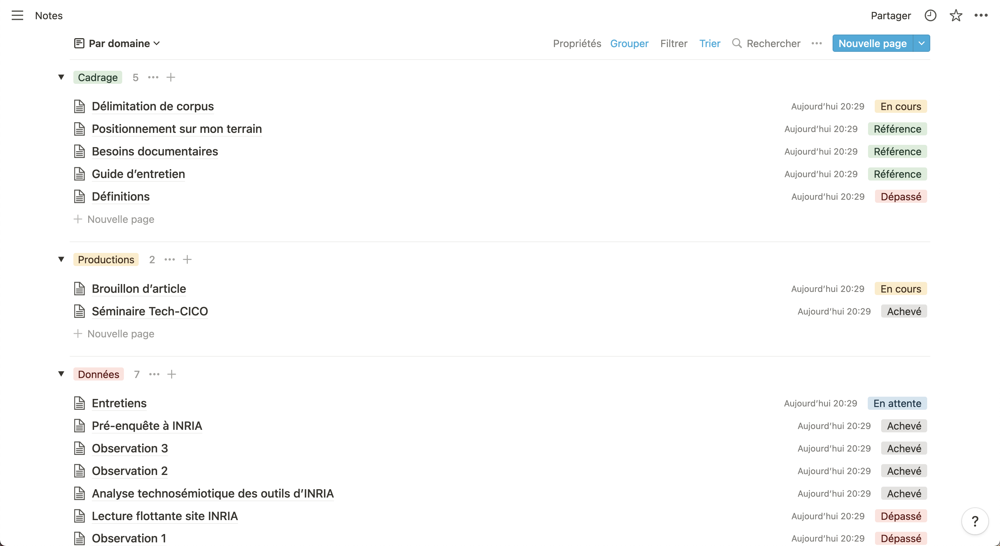

Maintenant qu’on a deux propriétés `Sélection`, on peut aussi imaginer grouper par “Statut”, pour voir d’un coup d’oeil les travaux en cours sans se soucier du domaine. Pour faire ça, vous pouvez dupliquer votre vue liste et ajuster les paramètres `Grouper`, `Trier` et `Propriétés`. J’aurais tendance à appeler ces 2 vues respectivement “Par domaine” et “Par statut”.

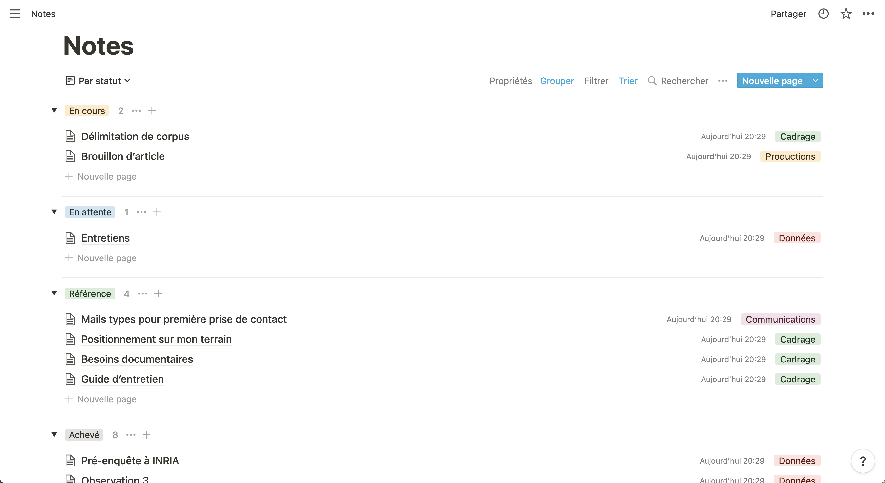

### Bonnes pratiques d’écriture et de navigation

Voici quelques conseils pour organiser le contenu de vos notes. J’ai développé ces pratiques à mesure que mes bases de données se complexifiaient et que j’avais besoin de lisibilité et de navigation rapide. Elles ne seront donc pas adaptées à tous les usages, vous pouvez piocher dedans comme bon vous semble :

- Inclure des encarts descriptifs au début de chacune de vos notes. Ils m’aident à me souvenir rapidement du contenu de la note, des intentions que j’avais, du contexte, etc. Ils me sont également indispensables lorsque je partage des documents avec des ami·es, qui ne connaissent pas tout mon processus de recehrche. En général, j’utilise les blocs `Encadré` pour ce genre de paratexte.
    
    
    
- Ajouter une table des matières au début de chacun de vos documents. Ça aide à visualiser rapidement la structure et à accéder aux différentes portions.
    
    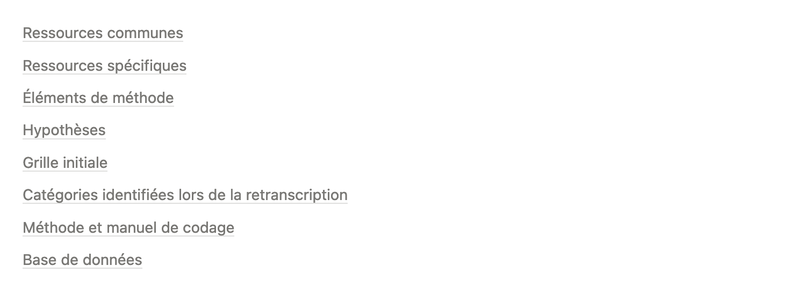
    
- Systématiquement ajouter 2 sections ressources en haut de vos notes :
    - Ressources communes : cette section contient les liens vers toutes les ressources pertinentes pour un aspect de votre recherche en particulier. Par exemple, tous les documents qui concernent vos entretiens.
    - Ressources spécifiques : cette section comprend les liens vers les ressources spécifiquement utiles pour cette note, par exemple : un article de wiki qui vous a servi à construire votre méthode dans une note de méthode.
    
    
    
    L’intérêt de séparer les 2 est de pouvoir utiliser des blocs synchronisés. Les blocs synchronisés sont des fragments de document Notion qui sont partagés entre plusieurs documents. Ça signifie donc que si je rajoute un lien dans le bloc “Ressources communes” de la note `Entretiens — Analyse`, il sera aussi ajouté à tous les endroits où le bloc apparaît.
    
    Pour obtenir un bloc synchronisé, il suffit de coller un fragment de document dans un autre et de sélectionner l’option `Coller et synchroniser`.
    
    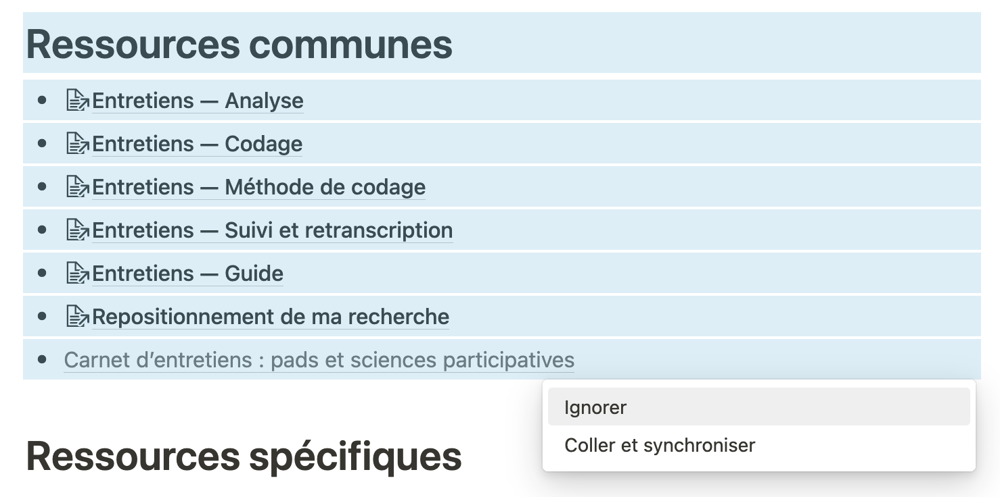
    
    Utiliser ces listes de liens me permet de créer des sous-écosystèmes documentaires à l’intérieur d’une base de données, tout en restant flexible puisque je peux y inclure n’importe quel document de mon espace de travail, et même des liens externes. Lorsqu’on a l’habitude de les utiliser, ça accélère beaucoup la navigation entre documents.
    
- Les blocs synchronisés ont beaucoup d’autres usages potentiels que les listes de liens. Je les utilise par exemple pour assembler des fragments de documents méthodologiques que je souhaite garder sous les yeux dans un document d’analyse. On peut aussi envisager d’écrire plusieurs parties d’un rapport dans différents documents et de les assembler, d’insérer des définitions à partir d’un document de définitions, etc.
- Comme Notion s’appuie sur Markdown, il est possible de copier-coller un document directement dans [Stylo](https://stylo.huma-num.fr/) en conservant la mise en forme. C’est le logiciel que j’utilise lorsque je souhaite rédiger un article avec des notes de bas de page. Stylo est un éditeur d’articles scientifiques libre développé par [Huma-Num](https://www.google.com/search?client=firefox-b-d&q=humanum), qui offre beaucoup d’options dédiées à l’écriture académique : annoter et collaborer, écrire facilement des métadonnées, synchroniser avec une bibliographie [Zotero](https://www.zotero.org/), exporter dans une diversité de formats, etc.

## 4. Application : gestion et analyse d’entretiens

<aside>

⚑ Quand on enquête, on a parfois beaucoup d’interlocuteur·rices avec lesquel·les mener des entretiens. Ça demande un suivi très précis afin de noter les dates, les contacts, centraliser les retranscriptions, analyser ensemble tous ses entretiens, etc. On va donc voir comment :

- créer un tableau et un calendrier de suivi des entretiens
- stocker ses enregistrements et ses retranscriptions
- répartir la charge de travail entre plusieurs enquêteur·ses
- coder ses entretiens
</aside>

### Tableau d’entretiens

Créer un tableau qui liste toutes les personnes que l’on souhaite interviewer. Si j’ai beaucoup d’enquêté·es, j’aurais tendance à créer plusieurs colonnes pour qualifier les personnes en fonction de la nature de ma recherche. Ici, il s’agit d’une enquête fictive auprès de grand·es chercheur·ses du 20è et 21è siècle, voici les colonnes que j’ai choisies :

- `Sélection` : “Type d’enquêté·e”, j’y précise s’il s’agit d’un·e `chercheur·se`, d’un·e `doctorant·e`, d’un·e `technicien·ne`, etc.
- `Sélection multiple` : “Organisation”, pour noter le centre de recherche ou unité de service où travaille la personne.
- `Texte` : “Contact”, je peux y noter des mails, mais aussi des numéros de téléphone ou des adresses postales. Même s’il existe des colonnes `E-mail`, je trouve qu’elles sont moins flexibles qu’une simple colonne `Texte`.

La première chose qu’on va vouloir faire lorsqu’on commence une série d’entretiens, c’est de pouvoir garder une trace de l’avancement de chaque entretien. En effet, on contacte souvent les gens individuellement, et les échanges de mails pour convenir d’une rencontre sont parfois longs. J’utilise donc en général une colonne `Sélection` que j’intitule “Statut”, dont voici les catégories :

- `À contacter` : j’ai décidé de prendre contact mais je ne l’ai pas encore fait.
- `Contacté·e` : j’ai envoyé un mail ou passé un appel, mais nous n’avons pas encore trouvé de moment pour se rencontrer. Ce statut, même s’il peut sembler un peu superflu, m’est très utile : ça me permet de savoir rapidement qui je dois relancer.
- `Entretien prévu` : nous avons fixé une date d’entretien.
- `Entretien réalisé` : l’entretien est réalisé et enregistré.
- `Entretien retranscrit` : l’entretien est retranscrit.
- `Entretien codé` : l’entretien est codé.

Je vous conseille d’ajouter des couleurs et d’ordonner les statuts selon les objets que vous aimeriez voir apparaître en premier. J’utilise souvent des dégradés de couleur pour signifier la processualité.

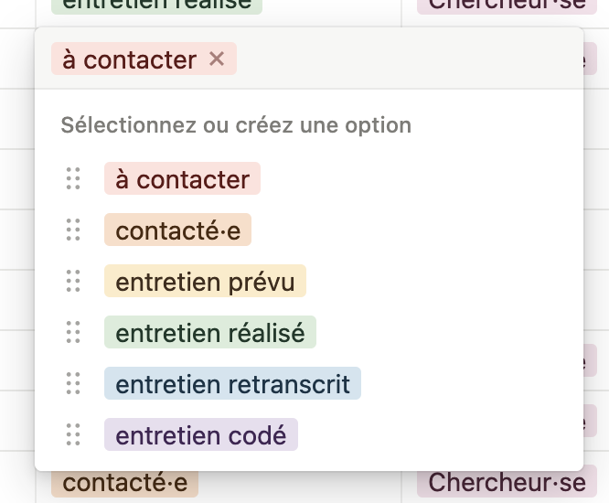

Quand on a beaucoup de colonnes `Sélection`, les tableaux ou les listes peuvent devenir très colorés, ce qui peut nuire à la discrimination immédiate entre les différents statuts. J’aurai donc tendance à mettre en gris les tags des colonnes *où la couleur a le moins d’intérêt*.

Par exemple, je sais que mes enquêté·es vont appartenir à beaucoup d’organisations différentes, il y a donc des chances pour qu’il y ait plus de laboratoires que de couleurs, et il me sera difficile de retenir quelle couleur correspond à quoi. Ce tri est moins important que les autres, alors j’aurais tendance à le griser :

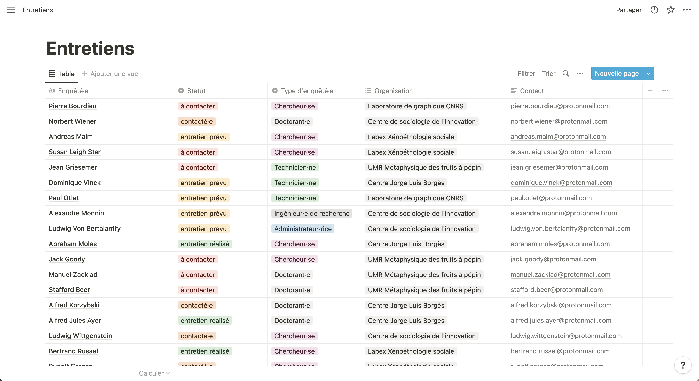

Notre tableau est un peu plus lisible, mais on peut également le `Grouper` par “Statut”. De cette manière, on pourra voir plus clairement ce qui est urgent — par exemple les personnes `à contacter`. N’oubliez pas de trier les catégories dans l’ordre voulu — par exemple de manière à reproduire le processus — et de masquer la colonne “Statut” puisque le tableau est déjà groupé sur cette base.

### Calendrier

Pour aller plus loin dans le suivi de son enquête, on peut afficher la base de données sous forme de `Calendrier`. La première chose à faire est de créer une colonne `Date`, qui pourra s’appeler par exemple “date de l’entretien”. On peut y inclure la date, mais aussi l’heure de début et de fin, afin d’être sûr·e de ne rien oublier.

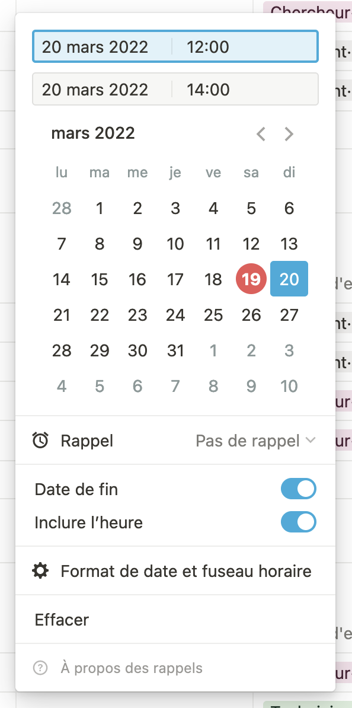

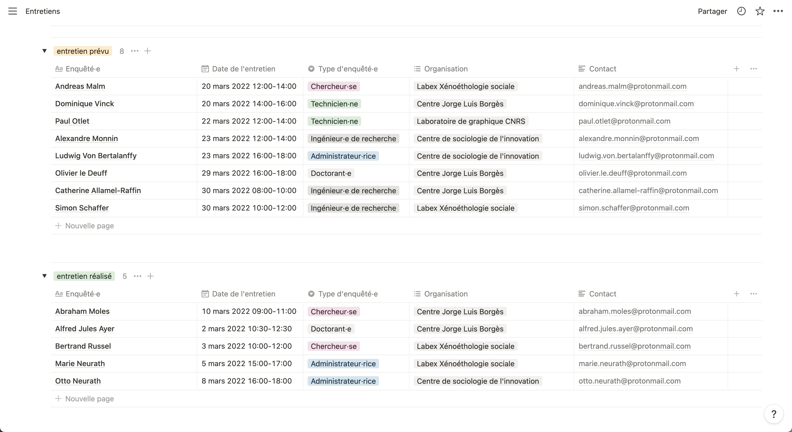

Ce tableau ne permet pas encore de visualiser rapidement l’emploi du temps lié à l’enquête. Pour faire ça, créer une vue `Calendrier`, puis sélectionner la propriété “date de l’entretien” dans `•••`, `Disposition` puis  `Afficher le calendrier par`.

Il faut également ajuster les `Propriétés` que l’on souhaite voir, qui sont toutes masquées par défaut. Dans mon cas, j’ai affiché l’organisation, le type d’enquêté·e et leur contact. Pas besoin d’afficher leur statut puisque je sais déjà que les éléments qui se trouvent sur le calendrier sont soit `prévus` (ceux qui sont encore à venir), soit `réalisés` (ceux qui sont déjà passés).

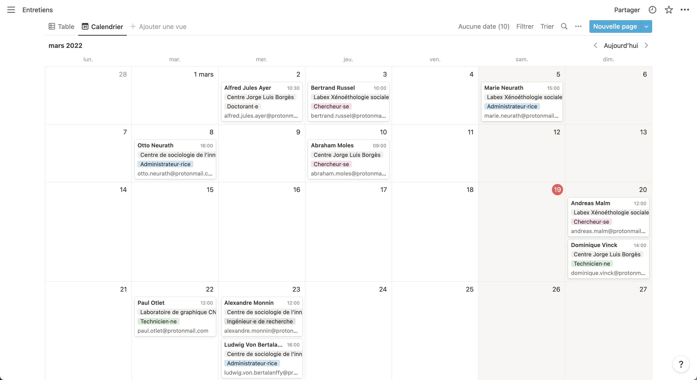

En haut à droite du tableau, à gauche des options de filtre, le calendrier m’informe qu’il y a encore 10 éléments qui n’ont `aucune date` attribuée. En cliquant dessus, ils s’affichent dans le calendrier et on peut les déplacer.

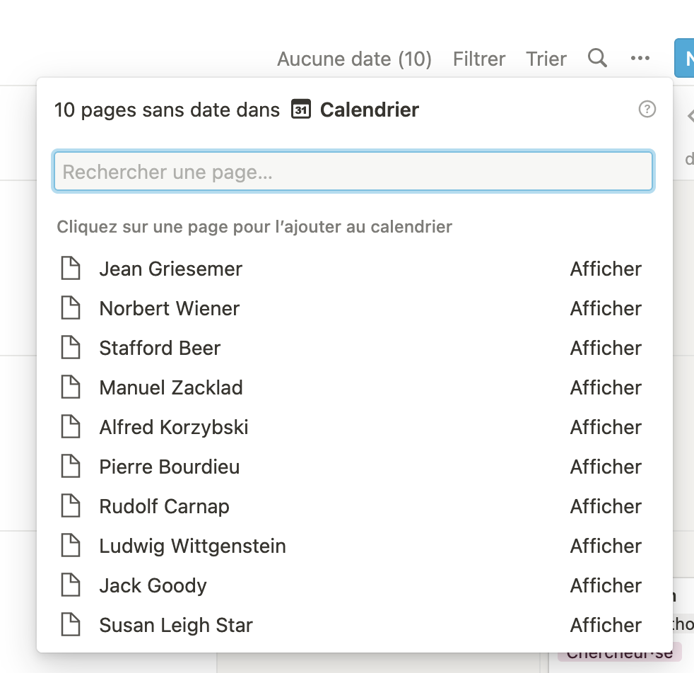

### Retranscription

Comme n’importe quelle page Notion peut être partagée, il est possible d’utiliser cette base de donnée comme outil collaboratif. On peut par exemple créer deux colonnes `Sélection` ou `Personne` :

- “Responsable entretien” : la personne en charge de mener l’entretien, rien n’empêche d’en mettre plusieurs.
- “Responsable retranscription” : la personne en charge de retranscrire.

On peut aussi ajouter une colonne `Fichiers et médias` qui s’appellerait “Enregistrement”, pour stocker les enregistrements des entretiens.

Pour retranscrire, je télécharge souvent mes enregistrements sous forme de vidéos en privé sur Youtube, puis je copie les sous-titres automatiques vers [Otranscribe](https://otranscribe.com/). Je réécoute alors l’entretien en corrigeant le texte généré par Youtube, puis je le copie-colle dans la page Notion de la personne.

### Analyse

En fonction du niveau de précision avec lequel on souhaite analyser ses entretiens, il y a plein de formes de base de données à inventer avec Notion.

Si l’on fait un codage à gros traits, où l’on ne va pas attribuer de codes à des verbatims mais plutôt à l’entretien en général, on peut utiliser la même base de données. On commencera par créer une nouvelle vue “Codage”, où l’on appliquera un filtre qui ne montre que les `entretiens retranscrits`. En effet, on sait que c’est seulement après la retranscription qu’on pourra coder un entretien.

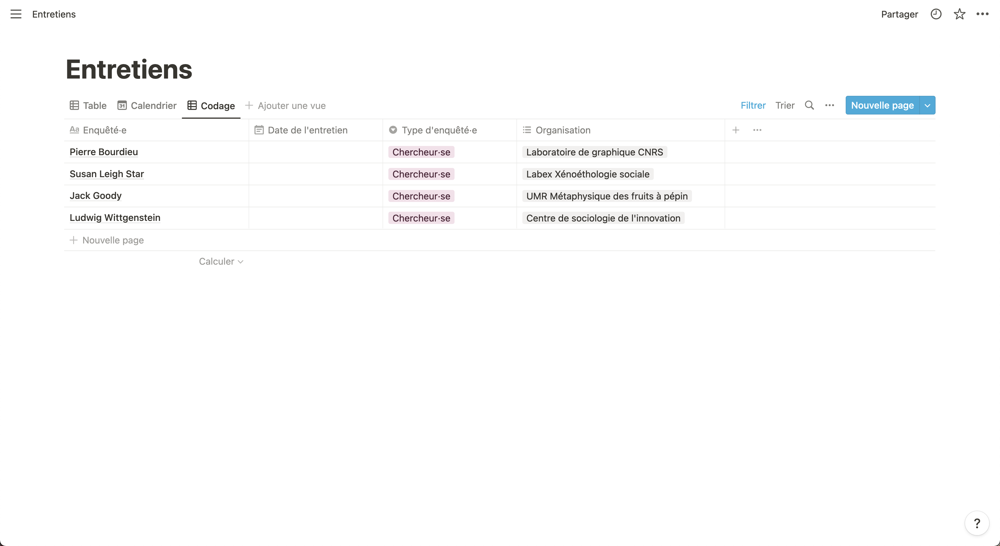

Une fois qu’on a masqué les colonnes inutiles pour le codage, créer pour chaque (sous-)catégorie de codage :

- Une colonne `texte` intitulée “[nom de la catégorie] - verbatims”. Elle servira à stocker les principaux verbatims qui concernent cette catégorie de codage si on veut s’y référer lors de l’analyse.
- Une colonne `Sélection multiple` qu’on appellera “[nom de la catégorie] - codes”. Elle permettra d’attribuer des codes à l’entretien, soit au fil de la lecture, soit en partant de la colonne de verbatims.

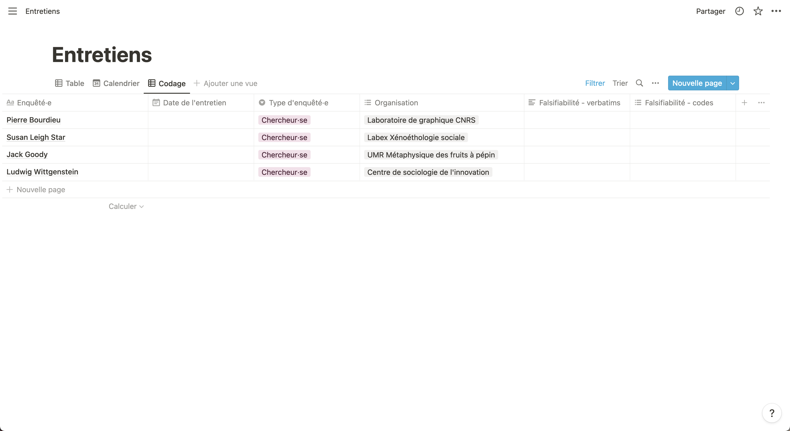

Pour des analyses plus fines, on pourra utiliser une autre base de données, dans laquelle on stockera des verbatims, qui seront :

- attribués à un entretien à l’aide d’une colonne `Relation`
- codés avec autant de colonnes `Sélection multiple` que vous avez de catégories
- référencés à l’aide d’un `URL` vers le paragraphe original

Vous pouvez également leur attribuer un index dans une colonne `Nombre`, afin de pouvoir retrouver leur ordre.

La seule fois où j’ai utilisé cette forme de base de données, elle s’est avérée un outil de recherche extrêmement utile. Il suffit de quelques caractères tapés dans la barre de recherche en haut à droite pour trouver tous les verbatims liés à un code et faire des liens très rapidement entre les entretiens. Ça facilite également beaucoup les comptages.