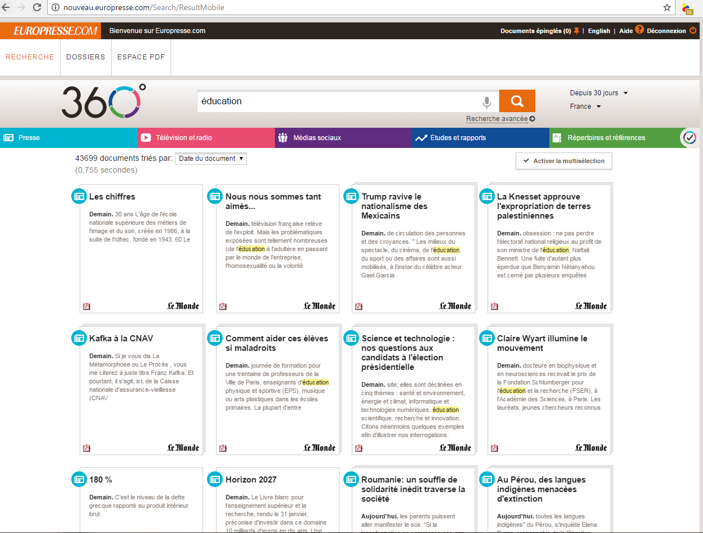

"Automatiser et faciliter la collecte d'un corpus sur Europresse".

Europresse est une base de données d'archivage d'articles de presse et de contenus informationnels issus du web. Son utilisation est courante dans la recherche en SHS lorsque l'on souhaite réaliser des analyses du traitement médiatique de discours de presse.

Gaël Lejeune (STIH) et Thibault Grison (SCAI / GRIPIC), dans une intervention collective animée par Lisa Bolz (GRIPIC), ont ainsi présenté le 30 septembre 2021 des méthodes de choix des mots-clés et des sources, ou encore des méthodes pour stocker des corpus extraits de la plateforme. Il a également été abordé la question de la visualisation de corpus par sources, et de la difficulté à produire des analyses quantitatives en raison des différentes dates d'archivages sur Europresse selon les titres de presse. Enfin, il a été abordé lors de cet atelier les manières d'automatiser la collecte de corpus pour en faciliter cette dernière.